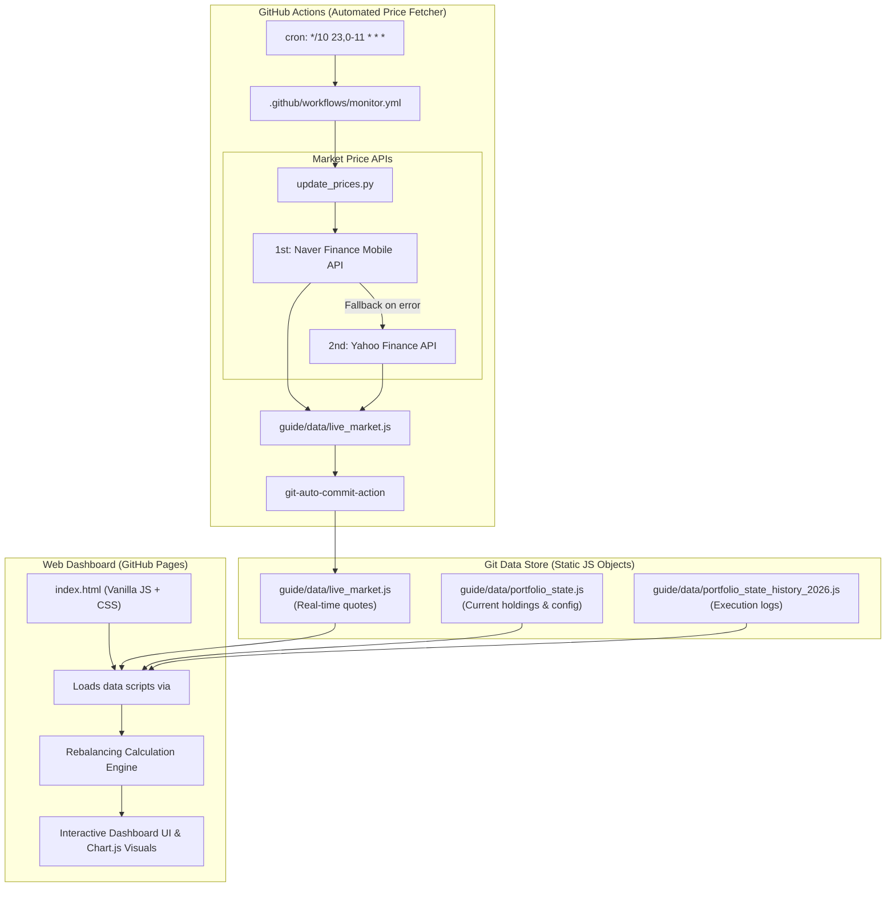

# AGENTS.md - Developer & AI Agent Guidelines for `my-stock`

Welcome to the `my-stock` repository. This document serves as a comprehensive system manual and operational guide for AI coding assistants and developers working on or maintaining this codebase.

---

## 1. Project Overview & Objectives

* **Project Name**: `my-stock` (국내주식 스마트 포트폴리오 리밸런싱 대시보드)
* **Live URL**: `https://insford.github.io/my-stock/`
* **Core Purpose**:
  * Tracks and manages a Korean stock portfolio centered around core semiconductor giants (**Samsung Electronics** & **SK Hynix**) and hedging/stabilizing ETF assets (**CD Rate, SOFR Dollar, US 30Y Treasury, KRX Gold, S&P 500**).
  * Automatically collects real-time/close market prices via GitHub Actions and updates data state.
  * Calculates dynamic target weights based on a **KOSPI 6,000 ~ 8,500 Box-Range Strategy**.
  * Employs a **Trigger-Relaxed Rebalancing Strategy (±8.0%p Gap)** to minimize transaction noise and maximize compound returns.

---

## 2. System Architecture & Tech Stack



### Technology Stack
* **Frontend**: Pure HTML5, Modern CSS3 (Glassmorphism Dark Theme, Flexbox/Grid), Vanilla JavaScript (ES6+), [Chart.js](https://www.chartjs.org/) (CDN).
* **Automation & Backend**: Python 3.10+ (Standard library `urllib.request`, `json`, `datetime` - zero heavy build dependencies).
* **CI/CD**: GitHub Actions workflow (`.github/workflows/monitor.yml`), GitHub Pages for static hosting.
* **Storage Mechanism**: Git-as-a-Database (State stored in global JavaScript objects attached to `window`).

---

## 3. Directory & File Structure

```text
my-stock/
├── .github/
│   └── workflows/
│       └── monitor.yml                    # Automated 10-minute cron workflow for market prices
├── guide/
│   ├── attachment/                        # Strategy simulation chart images
│   │   ├── bull_market_simulation.png
│   │   ├── level_relaxed_simulation.png
│   │   ├── rebalancing_simulation.png
│   │   ├── relaxed_band_simulation.png
│   │   └── trigger_relaxed_simulation.png
│   ├── data/                              # State storage files (JS global variables)
│   │   ├── live_market.js                 # [Auto-generated] Live prices and timestamps
│   │   ├── portfolio_state.js             # [User-maintained] Current stock shares & deposits
│   │   └── portfolio_state_history_2026.js# [User-maintained] Historical portfolio records
│   ├── 국내주식_리밸런싱_전략.md             # Detailed KOSPI 6,000~8,500 matrix strategy guide
│   ├── 국내주식_리밸런싱_종목선택.md         # Selected asset breakdown and ETF analysis
│   ├── 매매일지.md                          # Plaintext trading execution journal
│   └── 포트폴리오_2026-07-31.md             # Initial portfolio snapshot & diagnostic report
├── index.html                             # Main single-page web dashboard (Standalone SPA)
├── update_prices.py                       # Python script fetching Naver/Yahoo market prices
├── README.md                              # Public repository documentation
└── AGENTS.md                              # AI Agent & Developer Guidelines (This file)
```

---

## 4. Key Components & Data Specifications

### 4.1. Data Files (`guide/data/`)

#### 1. `portfolio_state.js`
Defines current portfolio holdings, cash reserve, and strategy parameters under `window.PORTFOLIO_STATE_DATA`:
```javascript
window.PORTFOLIO_STATE_DATA = {
  "last_updated": "YYYY-MM-DD",
  "account_name": "국내주식 종합_주식 리밸런싱",
  "holdings": {
    "samsung_shares": 576,        // Samsung Electronics (005930) shares
    "hynix_shares": 92,           // SK Hynix (000660) shares
    "deposit_krw": 18732121,      // Cash balance (예수금) in KRW
    "other_assets_krw": 79296856  // Total sum of other ETF assets
  },
  "other_assets_detail": {
    "kodex_cd_shares": 18,        // KODEX CD금리액티브 (459580)
    "tiger_sofr_shares": 261,     // TIGER 미국달러SOFR금리액티브 (456610)
    "ace_us30b_shares": 2228,     // ACE 미국30년국채액티브(H) (453850)
    "ace_gold_shares": 581,       // ACE KRX금현물 (411060)
    "tiger_snp500_shares": 438,   // TIGER 미국S&P500 (360750)
    "kodex_gold_shares": 0,       // Legacy / Inactive
    "kodex_us10b_shares": 0,      // Legacy / Inactive
    "kodex_snp500_shares": 0      // Legacy / Inactive
  },
  "strategy_config": {
    "min_trigger_gap_percent": 8.0, // Threshold gap (|current% - target%|) to trigger rebalancing
    "kospi_min_level": 6000,
    "kospi_max_level": 8500
  }
};
```

#### 2. `live_market.js`
Generated automatically by `update_prices.py` under `window.LIVE_MARKET_DATA`:
```javascript
window.LIVE_MARKET_DATA = {
  "last_updated": "2026-08-19 23:15:56",
  "prices": {
    "kospi": 6471.17,
    "samsung": 257500,
    "hynix": 1624000,
    "cd": 1075115,
    "sofr": 60615,
    "us30b": 7110,
    "gold": 27300,
    "snp500": 26635,
    "us10b": 11715
  }
};
```

#### 3. `portfolio_state_history_2026.js`
Chronological array `window.PORTFOLIO_STATE_HISTORY_2026` of past execution dates, notes, and holding snapshots.

---

## 5. Core Business Logic & Algorithms

### 5.1. KOSPI Dynamic Matrix (Level L0 ~ L6)

The strategy shifts weights between Semiconductor giants (Samsung + SK Hynix) and Other Assets based on KOSPI index levels:

| Level | KOSPI Range | Market Regime | Semiconductor Target | Other Assets Target | Key Action |
| :---: | :--- | :---: | :---: | :---: | :--- |
| **L6** | $\ge 8,500$ | Overheated Top | **32.5%** | **67.5%** | Lock in gains; secure maximum defensive buffer & cash |
| **L5** | $8,000 \sim 8,500$ | Upper Bull | **40.0%** | **60.0%** | Partial profit taking (execute only when gap $\ge 8\%p$) |
| **L4** | $7,500 \sim 8,000$ | Moderate Upper | **47.5%** | **52.5%** | Gradual upward adjustment |
| **L3** | $7,000 \sim 7,500$ | Neutral / Pivot | **55.0%** | **45.0%** | Baseline equilibrium (minimize trading) |
| **L2** | $6,500 \sim 7,000$ | Lower Bounce | **62.5%** | **37.5%** | Sell other assets $\rightarrow$ accumulate semiconductors |
| **L1** | $6,000 \sim 6,500$ | Undervalued | **70.0%** | **30.0%** | Aggressive low-cost semiconductor accumulation |
| **L0** | $< 6,000$ | Crisis Bottom | **77.5%** | **22.5%** | Maximum allocation to core semiconductors |

### 5.2. Trigger-Relaxed Rebalancing Rule ($\pm 8.0\%p$)

1. **Calculate Current Semiconductor Weight**:
   $$\text{Semi Value} = (\text{Shares}_{\text{Samsung}} \times P_{\text{Samsung}}) + (\text{Shares}_{\text{Hynix}} \times P_{\text{Hynix}})$$
   $$\text{Total Account Value} = \text{Semi Value} + \text{Deposit KRW} + \sum (\text{Shares}_{\text{ETF}_i} \times P_{\text{ETF}_i})$$
   $$\text{Current Semi \%} = \frac{\text{Semi Value}}{\text{Total Account Value}} \times 100$$

2. **Check Trigger Gap**:
   $$\text{Gap} = \text{Current Semi \%} - \text{Target Semi \% (from KOSPI Level)}$$
   * If $|\text{Gap}| \ge 8.0\%p$: **Trigger Rebalancing Alert** (🚨 매매 필요).
   * If $|\text{Gap}| < 8.0\%p$: **Maintain Hold Status** (🟢 정상 범위 유지 / 관망).

3. **Rebalancing Order Calculation**:
   * **Target Delta Amount**:
     $$\Delta \text{KRW} = (\text{Target Semi \%} - \text{Current Semi \%}) \times \text{Total Account Value}$$
   * **Semiconductor Split Ratio**:
     * Samsung Electronics: **55%** of Semiconductor pool
     * SK Hynix: **45%** of Semiconductor pool
   * **Other Assets Split Ratio** (100% of non-semiconductor capital):
     * KODEX CD금리액티브 (`459580`): **25%** (KRW Cash reserve)
     * TIGER 미국달러SOFR금리액티브 (`456610`): **20%** (USD Hedge cash reserve)
     * ACE 미국30년국채액티브(H) (`453850`): **20%** (US Long bond monthly dividend)
     * ACE KRX금현물 (`411060`): **20%** (Physical gold hedge)
     * TIGER 미국S&P500 (`360750`): **15%** (US Broad market growth)

---

## 6. Development & Maintenance Guidelines for Agents

### 6.1. Updating Holdings After Trade Execution
When the user executes a trade or requests a portfolio state update, follow this strict three-step synchronization:

1. **Update `guide/data/portfolio_state.js`**:
   * Update `holdings` (e.g. `samsung_shares`, `hynix_shares`, `deposit_krw`).
   * Update `other_assets_detail` with the new share counts.
   * Update `last_updated` to the current date (`YYYY-MM-DD`).
2. **Append to `guide/data/portfolio_state_history_2026.js`**:
   * Add a new entry to `window.PORTFOLIO_STATE_HISTORY_2026` with `date`, `note`, `prices`, `holdings`, and `other_assets_detail`.
3. **Log in `guide/매매일지.md`**:
   * Add a markdown section describing trade reason, buy/sell breakdown, post-trade holdings, and execution date.

### 6.2. Modifying Price Fetching (`update_prices.py`)
* The script utilizes Naver Finance Mobile API as primary and Yahoo Finance API as fallback.
* If adding or modifying tracked tickers in `items`:
  ```python
  items = [
      ('key_name', 'naver_code', 'yahoo_symbol', 'index' or 'stock'),
      ...
  ]
  ```
* Standard library `urllib.request` is deliberately used for fast, dependency-free execution in GitHub Actions. Avoid introducing heavy packages unless necessary.

### 6.3. Modifying Web Dashboard (`index.html`)
* **Single-File Architecture**: All CSS, DOM structures, and client-side calculation logic reside in `index.html`.
* **Zero Build Step**: The app must run directly by opening `index.html` in a browser or serving via GitHub Pages. Do not introduce npm/webpack/vite build pipelines unless explicitly requested by the user.
* **Data Dependency**: `index.html` imports `portfolio_state.js`, `portfolio_state_history_2026.js`, and `live_market.js` via `<script>` tags in the `<head>` or before the inline logic. Always ensure backward compatibility of property keys.

### 6.4. Best Practices & Do's / Don'ts
* ❌ **Do NOT hardcode live market prices** into `index.html`; always rely on `window.LIVE_MARKET_DATA`.
* ❌ **Do NOT overwrite `live_market.js` manually** when editing portfolio configuration; it is updated by GitHub Actions.
* ✅ **Always verify mathematical consistency** across share counts, prices, cash deposits, and sum totals when updating portfolio data files.
* ✅ **Keep mobile responsiveness** intact: `index.html` is frequently accessed on mobile devices (M-Stock trading environment). Ensure glassmorphism cards and charts scale cleanly on small viewports.
