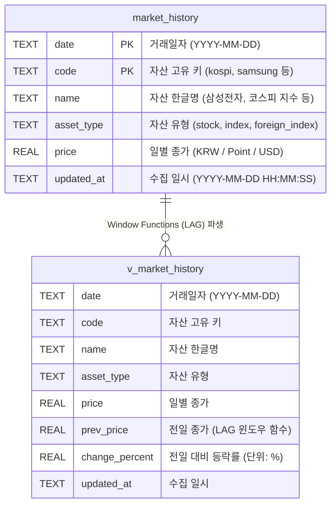
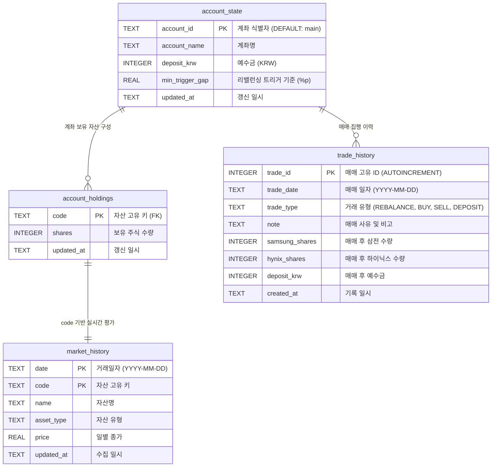

# 📊 데이터베이스 스키마 명세서 (`DB_SCHEMA.md`)

본 문서는 `my-stock` 프로젝트에서 사용하는 **SQLite 데이터베이스(`guide/data/market_history.db`)**의 테이블 구조, 인덱스, 뷰(View) 및 향후 확장 스키마를 정의한 명세서입니다.

---

## 1. 개요 (Overview)

* **데이터베이스 파일**: `guide/data/market_history.db`
* **관리 엔진**: SQLite 3 (WASM / `sql.js` 브라우저 런타임 호환)
* **주요 목적**: 
  * 국내외 주요 지수(KOSPI, S&P 500) 및 포트폴리오 편입 종목(반도체, 채권/금/달러 ETF 등)의 **최근 50거래일 일별 종가 히스토리 보관**
  * 일별 전일 대비 등락률(`change_percent`) 및 전일 종가(`prev_price`) 자동 계산 뷰 제공
  * 프론트엔드(`index.html`)에서 GitHub Pages 정적 CDN 환경을 통해 WASM 바이너리로 직접 로드 및 조회
* **자동 갱신 주기**: 월~금 08:00~20:00 KST 매 10분 (GitHub Actions `.github/workflows/monitor.yml` ➔ `update_history.py --update`)

---

## 2. ER 다이어그램 (Entity-Relationship Diagram)



---

## 3. 테이블 상세 명세

### 3.1. `market_history` (시장 일별 종가 테이블)

국내외 주식, 지수 및 ETF의 일별 종가 데이터를 일자별·종목별로 저장하는 핵심 테이블입니다.

#### DDL (Data Definition Language)
```sql
CREATE TABLE IF NOT EXISTS market_history (
    date TEXT NOT NULL,          -- 거래일자 (YYYY-MM-DD)
    code TEXT NOT NULL,          -- 자산 고유 키 (kospi, snp500_index, samsung 등)
    name TEXT NOT NULL,          -- 자산명 (삼성전자, 코스피 지수 등)
    asset_type TEXT NOT NULL,    -- 자산 유형 (stock, index, foreign_index)
    price REAL NOT NULL,         -- 일별 종가
    updated_at TEXT NOT NULL,    -- 수집 일시 (YYYY-MM-DD HH:MM:SS)
    PRIMARY KEY (date, code)
);
```

#### 컬럼 명세 (Column Specifications)
| 컬럼명 | 데이터 타입 | 제약 조건 | 설명 | 예시 값 |
|---|---|:---:|---|---|
| `date` | `TEXT` | **PK**, NOT NULL | 거래 일자 (`YYYY-MM-DD` 형식) | `'2026-08-28'` |
| `code` | `TEXT` | **PK**, NOT NULL | 자산 식별 고유 코드 (영문 소문자) | `'kospi'`, `'samsung'` |
| `name` | `TEXT` | NOT NULL | 자산 한글 표시명 | `'삼성전자'`, `'코스피 지수'` |
| `asset_type` | `TEXT` | NOT NULL | 자산 분류 (`stock`, `index`, `foreign_index`) | `'stock'` |
| `price` | `REAL` | NOT NULL | 해당 일자의 시장 종가 | `257500.0`, `6834.50` |
| `updated_at` | `TEXT` | NOT NULL | 배치 수집 및 적재 일시 | `'2026-08-28 10:55:26'` |

#### 인덱스 명세 (Index Specifications)
| 인덱스명 | 대상 컬럼 | 인덱스 유형 | 설명 / 활용 목적 |
|---|---|:---:|---|
| `sqlite_autoindex_market_history_1` | `(date, code)` | Unique / Primary | 복합 기본키 보장 및 날짜-종목 유일성 검증 |
| `idx_code_date` | `(code, date)` | Non-Unique (B-Tree) | 종목별 시계열 조회 속도 최적화 (`WHERE code = ? ORDER BY date ASC`) |

---

## 4. 뷰(View) 상세 명세

### 4.1. `v_market_history` (시세 추이 및 등락률 뷰)

`market_history` 테이블에 SQLite 윈도우 함수 `LAG()`를 적용하여, 직전 거래일 종가(`prev_price`) 및 전일 대비 등락률(`change_percent`)을 동적으로 연산하는 분석용 뷰입니다.

#### DDL (Data Definition Language)
```sql
CREATE VIEW IF NOT EXISTS v_market_history AS
SELECT 
    date,
    code,
    name,
    asset_type,
    price,
    LAG(price, 1) OVER (PARTITION BY code ORDER BY date ASC) AS prev_price,
    ROUND((price - LAG(price, 1) OVER (PARTITION BY code ORDER BY date ASC)) / LAG(price, 1) OVER (PARTITION BY code ORDER BY date ASC) * 100, 2) AS change_percent,
    updated_at
FROM market_history;
```

#### 컬럼 명세 (Calculated Columns)
| 컬럼명 | 데이터 타입 | 계산 공식 / 로직 | 설명 |
|---|---|---|---|
| `date` | `TEXT` | `market_history.date` | 거래 일자 |
| `code` | `TEXT` | `market_history.code` | 자산 고유 키 |
| `name` | `TEXT` | `market_history.name` | 자산 한글명 |
| `asset_type` | `TEXT` | `market_history.asset_type` | 자산 유형 |
| `price` | `REAL` | `market_history.price` | 당일 종가 |
| `prev_price` | `REAL` | `LAG(price, 1) OVER (PARTITION BY code ORDER BY date ASC)` | 직전 거래일 종가 |
| `change_percent` | `REAL` | `ROUND((price - prev_price) / prev_price * 100, 2)` | 전일 대비 등락률 (%) |
| `updated_at` | `TEXT` | `market_history.updated_at` | 수집 일시 |

---

## 5. 관리 대상 자산 코드 매핑 (Asset Code Mapping)

`market_history.db`에 적재되는 총 11종(핵심 자산 9종 + 레거시 호환 2종)의 자산 목록입니다:

| 고유 키 (`code`) | 자산명 (`name`) | 자산 유형 (`asset_type`) | 네이버 단축코드 | 야후 심볼 | 비고 |
|:---:|---|:---:|:---:|:---:|---|
| `kospi` | 코스피 지수 | `index` | `KOSPI` | `^KS11` | 국내 대표 지수 (박스권 전략 기준) |
| `snp500_index` | S&P 500 지수 | `foreign_index` | `.INX` | `^GSPC` | 미국 대표 시장 지수 |
| `samsung` | 삼성전자 | `stock` | `005930` | `005930.KS` | 반도체 코어 자산 (비중 55%) |
| `hynix` | SK하이닉스 | `stock` | `000660` | `000660.KS` | 반도체 코어 자산 (비중 45%) |
| `cd` | KODEX CD금리액티브 | `stock` | `459580` | `459580.KS` | 기타 자산 (원화 현금성 버퍼 25%) |
| `sofr` | TIGER 미국달러SOFR금리액티브 | `stock` | `456610` | `456610.KS` | 기타 자산 (달러 현금성 버퍼 20%) |
| `us30b` | ACE 미국30년국채액티브(H) | `stock` | `453850` | `453850.KS` | 기타 자산 (미국 장기채 월배당 20%) |
| `gold` | ACE KRX금현물 | `stock` | `411060` | `411060.KS` | 기타 자산 (금 현물 헤지 20%) |
| `snp500` | TIGER 미국S&P500 | `stock` | `360750` | `360750.KS` | 기타 자산 (미국 시장 지수 ETF 15%) |
| `us10b` | KODEX 미국채10년액티브 | `stock` | `308620` | `308620.KS` | 과거 이력 호환용 레거시 자산 |
| `fadu` | 파두 | `stock` | `440110` | `440110.KS` | 과거 이력 호환용 레거시 자산 |

---

## 6. 주요 SQL 쿼리 예제 (Query Examples)

### 6.1. 특정 종목의 최근 10거래일 시세 추이 및 등락률 조회
```sql
SELECT 
    date,
    name,
    price,
    prev_price,
    change_percent
FROM v_market_history
WHERE code = 'samsung'
ORDER BY date DESC
LIMIT 10;
```

### 6.2. 최신 거래일 기준 전체 자산 시세 스냅샷 조회
```sql
SELECT 
    code,
    name,
    asset_type,
    price,
    change_percent,
    date
FROM v_market_history
WHERE date = (SELECT MAX(date) FROM market_history WHERE code = 'kospi')
ORDER BY asset_type ASC, code ASC;
```

### 6.3. 최근 30거래일 간 KOSPI 지수 vs 삼성전자 일별 변동률 추이
```sql
SELECT 
    k.date,
    k.price AS kospi_point,
    k.change_percent AS kospi_change_pct,
    s.price AS samsung_price,
    s.change_percent AS samsung_change_pct
FROM v_market_history k
JOIN v_market_history s ON k.date = s.date
WHERE k.code = 'kospi' AND s.code = 'samsung'
ORDER BY k.date DESC
LIMIT 30;
```

---

## 7. 향후 확장 스키마 설계 (BACKLOG-01 전면 통합 로드맵)

향후 `portfolio_state.js` 및 `매매일지.md`를 SQLite로 완전 통합할 때 확장될 통합 ERD 구조입니다:



---
*문서 생성일: 2026-08-28*  
*관리 대상 DB: `guide/data/market_history.db`*
