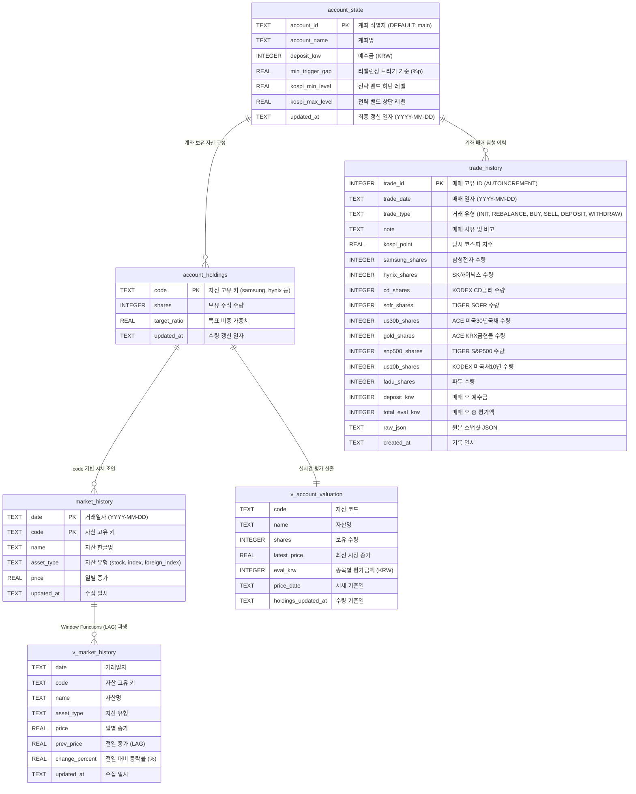

# 📊 데이터베이스 스키마 명세서 (`DB_SCHEMA.md`)

본 문서는 `my-stock` 프로젝트에서 사용하는 **통합 SQLite 데이터베이스(`guide/data/market_history.db`)**의 테이블 구조, 인덱스, 뷰(View) 및 관리 도구 체계를 정의한 공식 명세서입니다.

---

## 1. 개요 (Overview)

* **데이터베이스 파일**: `guide/data/market_history.db`
* **관리 엔진**: SQLite 3 (WASM / `sql.js` 브라우저 런타임 호환)
* **주요 목적**: 
  * 포트폴리오 **계좌 설정 및 예수금 상태(`account_state`)** 관리
  * 종목별 **실시간 주식 보유 수량(`account_holdings`)** 관리
  * 과거 및 신규 **매매 거래 집행 이력(`trade_history`)**의 완전한 트랜잭션 기록
  * 국내외 주요 지수 및 포트폴리오 편입 종목의 **일별 종가 히스토리(`market_history`)** 보관
  * 프론트엔드(`index.html`)에서 GitHub Pages 정적 CDN 환경을 통해 WASM 바이너리로 직접 로드 및 실시간 SQL 분석
* **자동 갱신 주기**: 
  * 시장 시세: 월~금 08:00~20:00 KST 매 30분 (GitHub Actions `.github/workflows/monitor.yml` ➔ `update_history.py --update`)
  * 매매 기록: 웹 대시보드 UI 또는 CLI 도구(`trade_logger.py`)를 통한 즉시 반영

---

## 2. ER 다이어그램 (Entity-Relationship Diagram)



---

## 3. 테이블 상세 명세

### 3.1. `account_state` (계좌 및 전략 설정 테이블)
계좌 기본 정보, 예수금 잔액 및 박스권 전략 설정 파라미터를 보관합니다.

#### DDL
```sql
CREATE TABLE IF NOT EXISTS account_state (
    account_id TEXT PRIMARY KEY,          -- 계좌 식별자 ('main')
    account_name TEXT NOT NULL,           -- 계좌명
    deposit_krw INTEGER NOT NULL,         -- 현금 예수금 (KRW)
    min_trigger_gap REAL DEFAULT 8.0,     -- 리밸런싱 트리거 Gap (±8.0%p)
    kospi_min_level REAL DEFAULT 6000.0,  -- 전략 밴드 최저치
    kospi_max_level REAL DEFAULT 8500.0,  -- 전략 밴드 최고치
    updated_at TEXT NOT NULL              -- 최종 갱신 일자 (YYYY-MM-DD)
);
```

### 3.2. `account_holdings` (자산별 보유 수량 테이블)
현재 포트폴리오를 구성하는 각 종목의 실시간 보유 주식 수를 관리합니다.

#### DDL
```sql
CREATE TABLE IF NOT EXISTS account_holdings (
    code TEXT PRIMARY KEY,                -- 종목 코드 (samsung, hynix 등)
    shares INTEGER NOT NULL,              -- 보유 주식 수
    target_ratio REAL DEFAULT 0.0,        -- 목표 비중 가중치
    updated_at TEXT NOT NULL              -- 수량 갱신 일자 (YYYY-MM-DD)
);
```

### 3.3. `trade_history` (매매 거래 이력 테이블)
포트폴리오 최초 설정부터 리밸런싱 및 개별 매매 집행 내역을 보관합니다.

#### DDL
```sql
CREATE TABLE IF NOT EXISTS trade_history (
    trade_id INTEGER PRIMARY KEY AUTOINCREMENT,
    trade_date TEXT NOT NULL,             -- 매매 일자 (YYYY-MM-DD)
    trade_type TEXT NOT NULL,             -- INIT, REBALANCE, BUY, SELL, DEPOSIT, WITHDRAW
    note TEXT,                            -- 매매 사유 및 비고
    kospi_point REAL,                     -- 체결 당시 코스피 지수
    samsung_shares INTEGER NOT NULL DEFAULT 0,
    hynix_shares INTEGER NOT NULL DEFAULT 0,
    cd_shares INTEGER NOT NULL DEFAULT 0,
    sofr_shares INTEGER NOT NULL DEFAULT 0,
    us30b_shares INTEGER NOT NULL DEFAULT 0,
    gold_shares INTEGER NOT NULL DEFAULT 0,
    snp500_shares INTEGER NOT NULL DEFAULT 0,
    us10b_shares INTEGER NOT NULL DEFAULT 0,
    fadu_shares INTEGER NOT NULL DEFAULT 0,
    deposit_krw INTEGER NOT NULL DEFAULT 0,
    total_eval_krw INTEGER DEFAULT 0,     -- 매매 후 총 평가금액 (KRW)
    raw_json TEXT,                        -- 상세 스냅샷 원본 JSON
    created_at TEXT NOT NULL              -- 기록 일시 (YYYY-MM-DD HH:MM:SS)
);

CREATE INDEX IF NOT EXISTS idx_trade_date ON trade_history(trade_date);
```

### 3.4. `market_history` (시장 일별 종가 테이블)
국내외 주식, 지수 및 ETF의 최근 50거래일 일별 종가 데이터를 일자별·종목별로 저장합니다.

#### DDL
```sql
CREATE TABLE IF NOT EXISTS market_history (
    date TEXT NOT NULL,                   -- 거래일자 (YYYY-MM-DD)
    code TEXT NOT NULL,                   -- 자산 고유 키 (kospi, samsung 등)
    name TEXT NOT NULL,                   -- 자산 한글명
    asset_type TEXT NOT NULL,             -- stock, index, foreign_index
    price REAL NOT NULL,                  -- 일별 종가
    updated_at TEXT NOT NULL,             -- 수집 일시 (YYYY-MM-DD HH:MM:SS)
    PRIMARY KEY (date, code)
);

CREATE INDEX IF NOT EXISTS idx_code_date ON market_history(code, date);
```

---

## 4. 뷰(View) 상세 명세

### 4.1. `v_market_history` (시세 추이 및 등락률 뷰)
```sql
CREATE VIEW IF NOT EXISTS v_market_history AS
SELECT 
    date,
    code,
    name,
    asset_type,
    price,
    LAG(price, 1) OVER (PARTITION BY code ORDER BY date ASC) AS prev_price,
    ROUND((price - LAG(price, 1) OVER (PARTITION BY code ORDER BY date ASC)) / LAG(price, 1) OVER (PARTITION BY code ORDER BY date ASC) * 100, 2) AS change_percent,
    updated_at
FROM market_history;
```

### 4.2. `v_account_valuation` (실시간 계좌 평가 뷰)
최신 시장 종가와 보유 수량을 조인하여 실시간 종목별 평가액을 산출합니다.
```sql
CREATE VIEW IF NOT EXISTS v_account_valuation AS
SELECT 
    h.code,
    COALESCE(m.name, h.code) AS name,
    h.shares,
    m.price AS latest_price,
    CAST(ROUND(h.shares * COALESCE(m.price, 0)) AS INTEGER) AS eval_krw,
    m.date AS price_date,
    h.updated_at AS holdings_updated_at
FROM account_holdings h
LEFT JOIN market_history m ON h.code = m.code
WHERE m.date = (SELECT MAX(date) FROM market_history WHERE code = h.code)
   OR m.date IS NULL;
```

---

## 5. 관리 대상 자산 코드 매핑 (Asset Code Mapping)

| 고유 키 (`code`) | 자산명 (`name`) | 자산 유형 | 네이버 코드 | 야후 심볼 | 비고 |
|:---:|---|:---:|:---:|:---:|---|
| `kospi` | 코스피 지수 | `index` | `KOSPI` | `^KS11` | 국내 대표 지수 (박스권 전략 기준) |
| `snp500_index` | S&P 500 지수 | `foreign_index` | `.INX` | `^GSPC` | 미국 대표 시장 지수 |
| `samsung` | 삼성전자 | `stock` | `005930` | `005930.KS` | 반도체 코어 자산 (비중 55%) |
| `hynix` | SK하이닉스 | `stock` | `000660` | `000660.KS` | 반도체 코어 자산 (비중 45%) |
| `cd` | KODEX CD금리액티브 | `stock` | `459580` | `459580.KS` | 기타 자산 (원화 현금성 버퍼 25%) |
| `sofr` | TIGER 미국달러SOFR금리액티브 | `stock` | `456610` | `456610.KS` | 기타 자산 (달러 현금성 버퍼 20%) |
| `us30b` | ACE 미국30년국채액티브(H) | `stock` | `453850` | `453850.KS` | 기타 자산 (미국 장기채 월배당 20%) |
| `gold` | ACE KRX금현물 | `stock` | `411060` | `411060.KS` | 기타 자산 (금 현물 헤지 20%) |
| `snp500` | TIGER 미국S&P500 | `stock` | `360750` | `360750.KS` | 기타 자산 (미국 시장 지수 ETF 15%) |
| `us10b` | KODEX 미국채10년액티브 | `stock` | `308620` | `308620.KS` | 과거 이력 호환용 레거시 자산 |
| `fadu` | 파두 | `stock` | `440110` | `440110.KS` | 과거 이력 호환용 레거시 자산 |

---

## 6. 주요 SQL 쿼리 예제 (Query Examples)

### 6.1. 실시간 포트폴리오 평가 총액 및 반도체 비중 계산
```sql
WITH valuation AS (
    SELECT 
        SUM(CASE WHEN code IN ('samsung', 'hynix') THEN eval_krw ELSE 0 END) AS semi_val,
        SUM(eval_krw) AS stock_val
    FROM v_account_valuation
),
deposit AS (
    SELECT deposit_krw FROM account_state WHERE account_id = 'main'
)
SELECT 
    v.semi_val,
    (v.stock_val + d.deposit_krw) AS total_portfolio_val,
    ROUND(v.semi_val * 100.0 / (v.stock_val + d.deposit_krw), 2) AS current_semi_ratio,
    d.deposit_krw
FROM valuation v, deposit d;
```

### 6.2. 최근 5건의 매매 거래 이력 조회
```sql
SELECT 
    trade_date,
    trade_type,
    note,
    samsung_shares,
    hynix_shares,
    deposit_krw,
    total_eval_krw
FROM trade_history
ORDER BY trade_date DESC, trade_id DESC
LIMIT 5;
```

---

## 7. 데이터베이스 버전 관리 및 스마트 캐싱 (`PRAGMA user_version` & Smart Merge)

본 데이터베이스는 테이블 구조와 무관하게 바이너리 파일 헤더에 **`PRAGMA user_version` (Unix Timestamp 초 단위 정수)**을 각인하여 계좌 및 매매 트랜잭션의 시간적 최신성을 100% 보장합니다.

* **버전 기록 (Write)**: 
  * 매매 발생 시 (`trade_logger.py`, `index.html`, `migrate_to_sqlite.py`): `PRAGMA user_version = <현재_Unix_초>` 실행하여 계좌 트랜잭션 버전 각인
  * 정기 시세 수집 시 (`update_history.py --update`): 기존 계좌 `user_version`을 훼손하지 않고 그대로 보존(Preserve)하여 버전 오염 방지
* **스마트 머지 (Smart Merge)**:
  * 브라우저는 GitHub Pages CDN 배포 딜레이(15~45초) 발생 시, 서버 DB와 로컬 캐시 DB의 `trade_history` (`MAX(trade_id)`, `COUNT(*)`)를 교차 비교합니다.
  * 로컬 매매 기록이 더 많거나 최신인 경우 **로컬 매매 상태를 100% 보존**하고, 서버 DB의 최신 시세(`market_history`)만 로컬 DB로 인메모리 Upsert 병합하여 데이터 유실을 완벽히 방지합니다.

---

## 8. 데이터 갱신 및 관리 도구 체계

1. **자동 수집 배치 (`update_history.py`)**: 
   * GitHub Actions를 통해 평일 매 30분 시장 시세를 `market_history`에 Upsert (정기 시세 수집 시 `user_version` 보존)
2. **CLI 매매 기록기 (`trade_logger.py`)**: 
   * 터미널에서 한 줄 명령어 또는 대화형 마법사(`-i`)로 매매 내역을 DB 및 마크다운 일지에 기록
   * `atomic_write_file` 임시 파일 교체 및 `with conn:` 단일 트랜잭션 경계 내에서 레거시 JS/MD 일괄 동기화 (DB Lock 방지 및 원자적 롤백 지원)
3. **Web UI 매매 기록기 (`index.html`)**: 
   * 대시보드 상단에서 GitHub REST Contents API를 호출하여 브라우저에서 직접 DB 및 상태 파일 커밋 & 푸시
   * **선제 스냅샷 5종 백업 (메모리 상태, History 배열, WASM DB 바이너리, LocalStorage 캐시/버전)**
   * **Fail-Safe 롤백 가드**: 4개 파일(`market_history.db`, `portfolio_state.js`, `portfolio_state_history_2026.js`, `매매일지.md`) 중 단 하나라도 실패 시 메모리/DB/LocalStorage 100% 원상태 복구

---
*최종 갱신일: 2026-08-28*  
*관리 대상 DB: `guide/data/market_history.db`*
