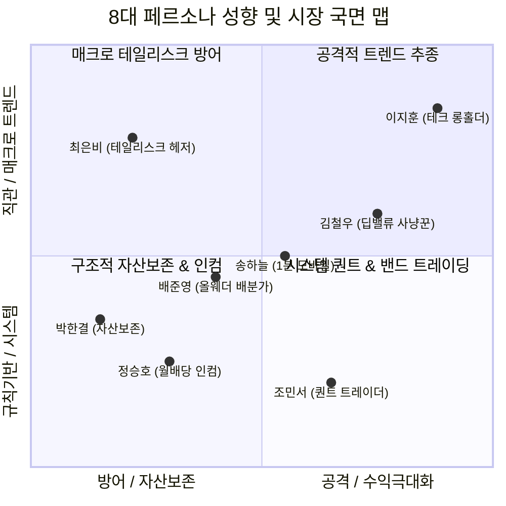

# 👥 국내주식 스마트 리밸런싱 8대 시장·투자 페르소나 정의서
# PERSONA.md

> **프로젝트 명칭:** `my-stock` (국내주식 스마트 포트폴리오 리밸런싱 대시보드)  
> **문서 버전:** v1.0 (8대 시장 국면 및 투자자 페르소나 완결본)  
> **목적:** KOSPI 6,000~8,500 동적 매트릭스, 반도체 2대장(삼성전자/SK하이닉스) + 5대 헤지 자산 ETF 포트폴리오, Trigger-Relaxed(±8.0%p Gap) 리밸런싱 전략의 실전 효용성과 리스크를 8개 투자 관점에서 입체적으로 검증합니다.

---

## 📖 목차

1. [페르소나 설계 배경 및 8대 페르소나 맵](#1-페르소나-설계-배경-및-8대-페르소나-맵)
2. [8대 시장·투자 페르소나 상세 프로필](#2-8대-시장투자-페르소나-상세-프로필)
   - [🧊 1. 박한결 (보수적 자산보존가)](#🧊-1-박한결-45세-보수적-자산보존가--capital-preservation-alpha)
   - [🚀 2. 이지훈 (테크/반도체 슈퍼사이클 롱홀더)](#🚀-2-이지훈-34세-테크반도체-슈퍼사이클-롱홀더--tech-bull-maximizer)
   - [📉 3. 김철우 (위기 바닥 사냥꾼 / 딥 밸류 역발상가)](#📉-3-김철우-48세-위기-바닥-사냥꾼--딥-밸류-역발상가--contrarian-dip-buyer)
   - [🌋 4. 최은비 (블랙스완 / 테일리스크 헤저)](#🌋-4-최은비-32세-블랙스완--테일리스크-헤저--tail-risk-hedger)
   - [💵 5. 정승호 (월배당 / 현금흐름 인컴 수집가)](#💵-5-정승호-41세-월배당--현금흐름-인컴-수집가--monthly-income-seeker)
   - [🎯 6. 조민서 (시스템 퀀트 밴드 트레이더)](#🎯-6-조민서-37세-시스템-퀀트-밴드-트레이더--systematic-band-trader)
   - [🌐 7. 배준영 (올웨더 글로벌 자산배분가)](#🌐-7-배준영-29세-올웨더-글로벌-자산배분가--all-weather-asset-allocator)
   - [📱 8. 송하늘 (모바일 1분 스마트 트레이더)](#📱-8-송하늘-33세-모바일-1분-스마트-트레이더--1-minute-mobile-trader)
3. [8대 페르소나별 포트폴리오 스트레스 테스트 & 검증 매트릭스](#3-8대-페르소나별-포트폴리오-스트레스-테스트--검증-매트릭스)
4. [페르소나 거버넌스 및 실전 리뷰 프로세스](#4-페르소나-거버넌스-및-실전-리뷰-프로세스)

---

## 1. 페르소나 설계 배경 및 8대 페르소나 맵

본 포트폴리오는 **단순 주식 몰빵이나 수동적 적립식이 아닌, 코스피 지수 레벨(L0~L6)에 따라 반도체 주식과 방어 자산의 비중을 능동적으로 전환하는 '스마트 밴드 리밸런싱 시스템'**입니다.

따라서 시장의 급등락, 금리/환율 충격, 세금/수수료 누수, 실제 MTS 매매 편의성 등 다양한 국면에서 시스템의 건전성을 다각도로 검증할 8인의 대표 페르소나를 정의합니다.

---

## 2. 8대 시장·투자 페르소나 상세 프로필

---

### 🧊 1. 박한결 (45세, 보수적 자산보존가 / Capital Preservation Alpha)

| 항목 | 상세 프로필 |
| :--- | :--- |
| **투자 성향** | 원금 보존 최우선형 / 극단적 하방 방어 추구 |
| **주요 직업** | 중견기업 재경팀장 (보수적 회계 마인드) |
| **핵심 철학** | **"워런 버핏의 제1원칙은 '절대로 돈을 잃지 마라'다. 수익률보다 중요한 것은 최대낙폭(MDD)이다."** |
| **중점 검증 포인트** | • 코스피 폭락 시 계좌 전체 MDD가 10~15% 이내로 안정적으로 방어되는가? • KODEX CD금리(25%)와 ACE 미국30년국채(20%), 금현물(20%)의 현금 및 안전자산 방패가 충분한가? • 반도체 집중 리스크(과거 88%)가 L3~L6 상단 진입 시 확실히 32.5~55% 수준으로 분산 락인되는가? |

> 💬 **페르소나 보이스:**  
> *"반도체가 아무리 좋아도 2022년이나 2024년 여름처럼 반토막 나는 국면에서는 멘탈이 무너집니다. CD금리와 금, 달러 채권이 튼튼하게 받쳐주지 않는 포트폴리오는 아무리 기대수익률이 높아도 낙제점입니다."*

---

### 🚀 2. 이지훈 (34세, 테크/반도체 슈퍼사이클 롱홀더 / Tech Bull Maximizer)

| 항목 | 상세 프로필 |
| :--- | :--- |
| **투자 성향** | 메가트렌드 성장주 추종형 / AI 인프라 수혜 극대화 |
| **주요 직업** | AI 빅테크 클라우드 엔지니어 |
| **핵심 철학** | **"AI 인프라 혁명의 핵심은 HBM과 메모리다. 대세 상승장에서 섣부른 조기 매도로 랠리를 놓치면 안 된다."** |
| **중점 검증 포인트** | • 상승 랠리 시 조기 매도로 인한 수익 누수(Trend Miss)를 Trigger-Relaxed(±8%p Gap)가 완벽히 방어하는가? • 삼성전자(55%)와 SK하이닉스(45%)의 밸런스가 HBM 리더십과 레거시 반등을 모두 균형 있게 담아내는가? • L1/L0 저평가 구간에서 반도체 비중을 70~77.5%까지 과감하게 끌어올려 복리 반등을 폭발시킬 수 있는가? |

> 💬 **페르소나 보이스:**  
> *"지수가 7,000에서 8,000으로 달릴 때 1~2% 올랐다고 찔끔찔끔 매도하면 결국 손가락만 빨게 됩니다. ±8%p 갭 완화 룰 덕분에 상승 추세를 끝까지 쥐고 갈 수 있어 테크 투자자로서 매우 신뢰가 갑니다."*

---

### 📉 3. 김철우 (48세, 위기 바닥 사냥꾼 / 딥 밸류 역발상가 / Contrarian Dip Buyer)

| 항목 | 상세 프로필 |
| :--- | :--- |
| **투자 성향** | 공포 매수 / 역발상 가치투자형 |
| **주요 직업** | 개인 자산가 / 전업 가치투자자 |
| **핵심 철학** | **"남들이 공포에 질려 던질 때 탐욕을 부리고, 남들이 환호할 때 현금을 챙겨라."** |
| **중점 검증 포인트** | • KOSPI 6,000 미만(L0) 공포 국면에서 기타자산(CD금리, 달러)을 털어 반도체 77.5%로 즉각 전환할 실탄이 확보되는가? • L6(8,500 이상) 과열 국면에서 기타자산 67.5%를 확보하여 다음 폭락장을 위한 '사냥용 실탄'을 확실히 충전하는가? • 감정에 휘둘리지 않고 지수 레벨 매트릭스에 따라 기계적인 저점 매수를 유도하는가? |

> 💬 **페르소나 보이스:**  
> *"바닥에서 주식을 사려면 평소에 현금과 안전자산을 쥐고 있어야 합니다. 상단에서 67.5% 실탄을 쟁여두고, 바닥에서 77.5%까지 주식을 쓸어 담는 이 구조야말로 진정한 역발상 가치투자의 정석입니다."*

---

### 🌋 4. 최은비 (32세, 블랙스완 / 테일리스크 헤저 / Tail-Risk Hedger)

| 항목 | 상세 프로필 |
| :--- | :--- |
| **투자 성향** | 거시경제 위기 대비 / 환율 및 원자재 헤지 중심 |
| **주요 직업** | 글로벌 무역상사 외환(FX) 딜러 |
| **핵심 철학** | **"지정학적 충격과 환율 급등, 인플레이션 쇼크는 예고 없이 찾아온다. 포트폴리오는 항상 방탄이어야 한다."** |
| **중점 검증 포인트** | • 원/달러 환율 급등(1,400원 돌파 등) 시 TIGER 미국달러SOFR(20%) 및 ACE KRX금현물(20%)의 환노출 자산이 환차익 방패 역할을 하는가? • ACE 미국30년국채(20%)는 환헤지(H)로 금리 인하 차익에만 순수 집중하도록 정교하게 설계되었는가? • 국내 주식(원화 자산)과 달러/골드/미국채 간의 음(-)의 상관관계가 실제 위기 시 작동하는가? |

> 💬 **페르소나 보이스:**  
> *"한국 증시가 흔들릴 때 원화만 들고 있으면 계좌가 이중으로 녹아내립니다. SOFR 달러 파킹과 실물 금현물, 환헤지 미국채 3각 방어선이 있기에 원화 급락 위기에도 든든합니다."*

---

### 💵 5. 정승호 (41세, 월배당 / 현금흐름 인컴 수집가 / Monthly Income Seeker)

| 항목 | 상세 프로필 |
| :--- | :--- |
| **투자 성향** | 주기적 배당 / 인컴 재투자 복리 추구 |
| **주요 직업** | IT 대기업 시니어 개발자 (조기 은퇴 파이어족 지향) |
| **핵심 철학** | **"자본 차익도 좋지만, 매월 통장에 꽂히는 현금흐름이 있어야 하락장에서도 마음 편히 버틴다."** |
| **중점 검증 포인트** | • ACE 미국30년국채액티브(H)의 매월 분배금(월배당)이 예수금으로 자동 입금되어 유동성을 공급하는가? • TIGER 미국S&P500 분기 배당 및 삼성전자 분기 배당이 계좌의 현금흐름 복리 엔진 역할을 하는가? • 누적된 배당금이 리밸런싱 예수금(`deposit_krw`)으로 자연스럽게 축적되어 추가 실탄으로 활용되는가? |

> 💬 **페르소나 보이스:**  
> *"단순히 시세 차익만 바라보면 주가 하락기에 지치기 쉽습니다. 미국 30년 국채의 월배당과 삼성전자의 분기 배당이 꾸준히 예수금으로 들어와 다음 매수 실탄이 되어주니 심리적으로 매우 안정됩니다."*

---

### 🎯 6. 조민서 (37세, 시스템 퀀트 밴드 트레이더 / Systematic Band Trader)

| 항목 | 상세 프로필 |
| :--- | :--- |
| **투자 성향** | 수리적 규칙 기반 / 거래비용 및 슬리피지 극소화 |
| **주요 직업** | 핀테크 자산운용 퀀트 시스템 엔지니어 |
| **핵심 철학** | **"인간의 감정은 항상 고점 매수, 저점 매도를 부른다. 알고리즘과 수학적 룰에 의해서만 주문을 집행해야 한다."** |
| **중점 검증 포인트** | • 엄격한 잦은 리밸런싱(±3%p) 대비 완화형(±8.0%p)의 연간 거래 횟수 감소(20회 ➔ 3~8회) 및 수수료 절감 효과가 입증되었는가? • 증권거래세 면제(ETF 0%)와 미래에셋 다이렉트 최저 수수료(0.0036~0.014%)를 적용한 세후 순수익률이 최적화되었는가? • 반도체 풀(삼전 55 : 하닉 45) 및 기타자산 5종(25:20:20:20:15) 배분 산식이 소수점 오차 없이 정확히 계산되는가? |

> 💬 **페르소나 보이스:**  
> *"백테스트 시뮬레이션 결과에서 증명되었듯이, 잦은 매매는 증권사 배만 불립니다. ±8.0%p 밴드 룰은 시장의 잔파도를 무시하고 굵직한 알파만 발라먹는 가장 세련된 퀀트 시스템입니다."*

---

### 🌐 7. 배준영 (29세, 올웨더 글로벌 자산배분가 / All-Weather Asset Allocator)

| 항목 | 상세 프로필 |
| :--- | :--- |
| **투자 성향** | 글로벌 거시 분산 / 샤프 지수(Sharpe Ratio) 극대화 |
| **주요 직업** | 벤처캐피탈(VC) 투자심사역 |
| **핵심 철학** | **"국내 주식에만 갇혀선 안 된다. 미국 지수, 글로벌 통화, 채권, 원자재를 믹스해 최적의 효율적 투자선(Efficient Frontier)을 구축해야 한다."** |
| **중점 검증 포인트** | • 한국 반도체 주식(성장) + 미국 S&P500(미국 성장) + 미국 30년 국채(안전채권) + 금(원자재) + 달러(기축통화) + CD금리(원화 현금)의 6대 자산군 포트폴리오가 올웨더 균형을 이루는가? • 상관계수 매트릭스상 자산 간 분산 효과가 극대화되어 단일 자산 대비 계좌 변동성이 낮아지는가? |

> 💬 **페르소나 보이스:**  
> *"이 포트폴리오는 겉으로는 삼전/하닉 중심이지만, 속을 뜯어보면 미국 S&P500과 골드, 미 국채, 달러 SOFR이 완벽한 올웨더 포메이션을 취하고 있습니다. 자산배분 관점에서 교과서적인 구조입니다."*

---

### 📱 8. 송하늘 (33세, 모바일 1분 스마트 트레이더 / 1-Minute Mobile Trader)

| 항목 | 상세 프로필 |
| :--- | :--- |
| **투자 성향** | 초단간 모바일 접근성 / 직관적 실전 주문 지향 |
| **주요 직업** | IT 스타트업 마케터 (바쁜 직장인 투자자) |
| **핵심 철학** | **"주식 화면을 10분 이상 들여다볼 시간은 없다. 대시보드를 켜자마자 3초 만에 오늘 뭘 사야 할지 나와야 한다."** |
| **중점 검증 포인트** | • 모바일 브라우저(스마트폰 M-Stock 화면)에서 대시보드가 0.5초 만에 반응형 다크 테마로 깔끔하게 열리는가? • 현재 KOSPI 레벨(L0~L6), 반도체 비중 vs 목표 비중, 갭(Gap), 그리고 🚨 매매 필요 여부(주문 수량표)가 한 화면에 즉시 파악되는가? • 계산기를 두드릴 필요 없이 '삼성전자 +3주 매수 / CD금리 -1주 매도' 형태로 떨어지는가? |

> 💬 **페르소나 보이스:**  
> *"장중에 복잡한 엑셀을 열 여유가 없어요. 모바일로 접속하자마자 '오늘 리밸런싱 필요 없음(정상 유지)' 딱 뜨거나, 신호 떴을 때 정확히 몇 주를 주문해야 하는지 한눈에 보여주는 UI가 최고입니다."*

---

## 3. 8대 페르소나별 포트폴리오 스트레스 테스트 & 검증 매트릭스

| 페르소나 | 주요 평가 국면 | 합격 기준 (DQS / 품질) | 리스크 감지 시 시스템 행동 지침 |
| :--- | :--- | :--- | :--- |
| **🧊 1. 박한결 (자산보존)** | KOSPI 폭락장 (6,000 하회) | 계좌 MDD $\le 15\%$ 방어 | CD금리·SOFR·금현물 안전자산 버퍼 30% 이상 유지 확인 |
| **🚀 2. 이지훈 (테크 롱홀더)** | 반도체 슈퍼사이클 랠리 | 조기 매도 없이 랠리 수익 보존 | $\pm 8.0\%p$ 갭 미달 시 매도 주문 원천 차단 (HODL) |
| **📉 3. 김철우 (딥밸류 사냥)** | 시장 패닉 / 극단적 공포 | L0/L1 구간 반도체 공격 매수 | 기타자산 매도 ➔ 삼성/하이닉스 최대 $70 \sim 77.5\%$ 주문 산출 |
| **🌋 4. 최은비 (테일리스크)** | 원/달러 환율 급등 & 지정학 위기 | SOFR·금 환차익 방어 확인 | 환노출 자산(SOFR 20% + 금 20%) 비중 이탈 여부 모니터링 |
| **💵 5. 정승호 (월배당 인컴)** | 횡보장 및 장기 보유 국면 | 월배당/분기배당 현금 누적 | ACE 미30년 국채 월분배금 예수금 반영 및 재투자 시뮬레이션 |
| **🎯 6. 조민서 (시스템 퀀트)** | 잦은 노이즈 변동장 | 연간 매매 횟수 8회 이하 | 장중 잔파도에 의한 잦은 리밸런싱 경고 방지 및 세후 수익률 검증 |
| **🌐 7. 배준영 (올웨더 배분)** | 글로벌 자산 간 엇갈림 장세 | 6대 자산군 분산 계수 건전성 | 반도체:기타자산 및 5대 ETF 세부 비율(25:20:20:20:15) 정밀 준수 |
| **📱 8. 송하늘 (1분 모바일)** | 장중 실시간 모바일 점검 | 3초 내 주문 수량 판독 가능 | Glassmorphism Dark UI, 모바일 카드 뷰, 주문 수량 정수화 표시 |

---

## 4. 페르소나 거버넌스 및 실전 리뷰 프로세스

1. **전략 및 알고리즘 수정 시:**
   - KOSPI 매트릭스 레벨 구간, 비중 비율, 트리거 갭 수정 시 **조민서(퀀트), 이지훈(테크), 박한결(보수)** 3인의 관점에서 백테스팅 및 MDD를 시뮬레이션합니다.
2. **신규 자산/ETF 편입 검토 시:**
   - 배당 수익률(정승호), 환헤지/환노출 적합성(최은비), 글로벌 상관계수(배준영) 검토를 거쳐 5대 기타자산 내 편입 타당성을 검증합니다.
3. **대시보드 UI/UX 변경 시:**
   - 송하늘(모바일 트레이더) 관점에서 한 손 조작성, 반응형 다크 테마, 폰트 가독성, 주문 수량 1초 파악 가능 여부를 점검합니다.
4. **리밸런싱 매매 신호 발생 시:**
   - 🚨 매매 필요 경고 발생 시 김철우(저점 사냥) 및 박한결(리스크 방어) 관점에서 신호의 유효성과 분할 주문 전략을 최종 크로스체크합니다.
