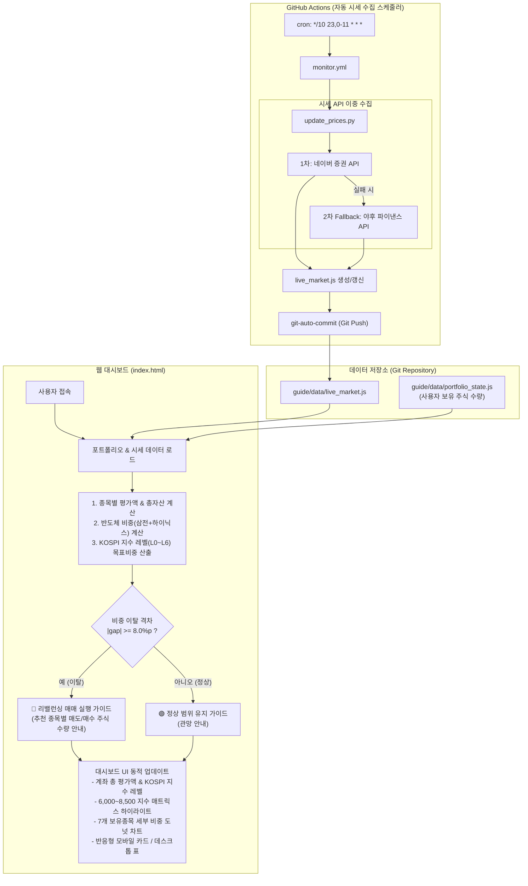

# 📈 국내주식 스마트 포트폴리오 리밸런싱 대시보드 (`my-stock`)

KOSPI 6,000 ~ 8,500 박스권 전략 기반의 국내주식 포트폴리오 자동 시세 수집 및 실시간 비중 리밸런싱 대시보드 프로젝트입니다.

---

## 🚀 시스템 동작 구조 (Architecture & Flow)

GitHub Actions 워크플로가 주식 시장 운영 시간 동안 10분 마다 최신 시세를 자동 수집하여 `live_market.js`를 갱신하며, `index.html` 웹 대시보드(`https://insford.github.io/my-stock/`)는 이 시세 데이터와 사용자의 보유 수량(`portfolio_state.js`)을 기반으로 실시간 비중 및 매매 가이드를 계산하여 제공합니다.



---

## 📂 주요 파일 및 폴더 구조

```text
my-stock/
├── index.html                               # 📈 국내주식 실시간 포트폴리오 리밸런싱 대시보드 (메인 SPA)
├── server.sh                                # 🚀 로컬 테스트용 웹서버 제어 스크립트 (start/stop/status)
├── update_prices.py                         # 10분 주기 실시간 시세 수집 스크립트 (Naver/Yahoo)
├── update_history.py                        # 15:05, 20:05 KST 일별 시장 히스토리 SQLite 수집 스크립트
├── DB_SCHEMA.md                             # 📊 SQLite 데이터베이스 스키마 & Mermaid ERD 명세서
├── BACKLOG.md                               # 포트폴리오 전면 SQLite 마이그레이션 개발 백로그
├── .github/
│   └── workflows/
│       ├── monitor.yml                      # 10분 주기 실시간 시세 자동 수집 워크플로우
│       └── history.yml                      # 매일 15:05, 20:05 KST 시장 히스토리 SQLite 자동 갱신 워크플로우
├── dc/                                      # 🏛️ 퇴직연금(DC) 20년 백테스트 & 장기 투자
│   ├── index.html                           # DC 퇴직연금 인터랙티브 시뮬레이션 대시보드
│   ├── DC_GUIDE.md                          # 미래에셋 DC 장기 투자 계획서 및 자동매수 가이드
│   └── data/                                # 20년(2006~2025) 백테스트 시뮬레이션 데이터 (JSON/JS)
└── guide/
    ├── 시장데이터_히스토리_수집_계획서.md     # SQLite-WASM 기반 일별 히스토리 수집 계획서
    ├── 국내주식_리밸런싱_전략.md              # KOSPI 6,000~8,500 매매조건 완화형 전략 문서
    ├── 국내주식_리밸런싱_종목선택.md          # 포트폴리오 편입 종목 및 ETF 분석
    ├── 매매일지.md                           # 리밸런싱 매매 기록 일지
    ├── 포트폴리오_2026-07-31.md              # 최초 포트폴리오 진단 및 구성 내역
    └── data/
        ├── market_history.db                # [자동 갱신] 일별 종가 SQLite 바이너리 DB (WASM 쿼리)
        ├── portfolio_state.js               # [사용자 수정] 계좌 보유 주식 수량 데이터
        ├── portfolio_state_history_2026.js  # [사용자 수정] 매매 집행 이력 스냅샷
        └── live_market.js                  # [자동 갱신] 수집된 최신 실시간 시세 및 갱신 시각
```

---

## 📊 데이터베이스 스키마 (Database Schema)

시장 데이터 수집 및 WASM 분석에 사용되는 SQLite DB(`guide/data/market_history.db`)의 테이블/뷰 구조 및 Mermaid ER 다이어그램은 [DB_SCHEMA.md](./DB_SCHEMA.md)에서 자세히 확인하실 수 있습니다.

* **테이블**: `market_history` (일자별·종목별 50거래일 종가 데이터)
* **뷰**: `v_market_history` (윈도우 함수 기반 전일 종가 `prev_price` 및 등락률 `change_percent` 자동 연산)
* **인덱스**: `idx_code_date` (`(code, date)` 복합 B-Tree 인덱스)

---

## 🎯 핵심 전략 요약 (KOSPI 6,000 ~ 8,500 완화형 매트릭스)

* **매매 조건 완화 (Trigger-Relaxed)**: 잦은 손절/차익실현 매매를 방지하기 위해 목표 비중과의 격차가 **±8.0%p 이상 이탈할 때만 굵직하게 리밸런싱 매매**를 실행합니다.
* **지수 레벨별 반도체 목표 비중**:

| 단계 | KOSPI 지수 구간 | 시장 성격 | 반도체 목표 비중 | 기타자산 목표 비중 |
| :---: | :--- | :---: | :---: | :---: |
| **L6** | 8,500 이상 | 상단 과열 | **32.5%** | 67.5% |
| **L5** | 8,000 ~ 8,500 | 상단 진입 | **40.0%** | 60.0% |
| **L4** | 7,500 ~ 8,000 | 상단 적정 | **47.5%** | 52.5% |
| **L3** | 7,000 ~ 7,500 | 중립 구간 | **55.0%** | 45.0% |
| **L2** | 6,500 ~ 7,000 | 현위치 하단 | **62.5%** | 37.5% |
| **L1** | 6,000 ~ 6,500 | 저평가 | **70.0%** | 30.0% |
| **L0** | 6,000 미만 | 바닥 | **77.5%** | 22.5% |

---

## 🛠️ 매매 집행 후 보유 수량 업데이트 방법

실제 매매를 진행한 후 파이썬 코드를 수정할 필요 없이, **JS 파일 하나만 수정 후 Git Push**하면 자동으로 반영됩니다.

1. 주식 앱에서 리밸런싱 매매 완료
2. [portfolio_state.js](file:///Users/insford/work/antigravity/my-stock/guide/data/portfolio_state.js)의 수량(`samsung_shares`, `hynix_shares` 등) 수정
3. [매매일지.md](file:///Users/insford/work/antigravity/my-stock/guide/매매일지.md)에 매매 내역 한 줄 기록
4. `git commit -m "Update portfolio after rebalancing"` ➔ `git push` 실행
