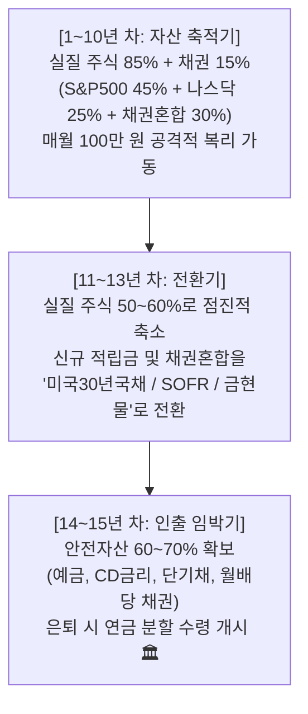

# 🏛️ 미래에셋증권 퇴직연금(DC) 장기 투자 운용 계획서 & 정밀 전략 가이드

> **작성일자**: 2026-08-28 (최종 포트폴리오 비중 확정: S&P500 45% / 나스닥 25% / 채권혼합 30%)  
> **운용 주체**: 본인 퇴직연금(DC) 계좌 (미래에셋증권)  
> **초기 투자금**: 약 2,000만 원 (DC 전환 일시금, 2회 분할 매수: 1,000만 원 × 2회)  
> **정기 적립금**: 매월 약 100만 원 (회사 퇴직연금 부담금 자동 입금 및 자동매수)  
> **목표 투자 기간**: 최소 10년 ~ 15년 이상 (은퇴 및 연금 개시 시점까지)  
> **핵심 전략**: 미국 대표 대형주 중심(S&P500 45% + 나스닥 25%) 적립식 장기 복리 + 채권혼합50(30%)을 통한 실질 주식 85.0% 극대화  

---

## 1. 퇴직연금(DC) 기본 환경 및 최신 규제 기준

### 1.1. 위험자산 70% 제한 룰 및 2023.11 감독규정 개정
* **위험자산 (최대 70%)**: 주식형 ETF (S&P 500, 나스닥 100 등)
* **안전자산 (최소 30%)**: 단기금리/CD/SOFR ETF, 채권형 ETF, 원리금보장상품, **채권혼합형 ETF(주식 비중 50% 이하)**
* 💡 **핵심 최신화 (2023.11 개정)**:
  * 퇴직연금감독규정 개정으로 채권혼합형 ETF의 **주식 편입 상한이 40% → 50%로 확대**되었습니다.
  * 이에 따라 **`438080` (ACE 미국S&P500미국채혼합50액티브)**은 `S&P500 50% + 미국채 50%`로 운용됩니다.
  * 안전자산 30% 슬롯에 이 상품을 담으면 **전체 계좌의 실질 주식 비중을 합법적으로 85.0%** (위험 70% + 30% × 50%)까지 끌어올릴 수 있습니다.

### 1.2. 한국주식과 금(Gold)을 제외하는 전략적 이유 & 리스크 관리
* **한국 주식을 제외하는 이유**:
  1. **자산 이원화 & 리스크 헤지**: 이미 일반 위탁계좌(`my-stock`)에서 삼성전자·SK하이닉스 중심의 KOSPI 박스권 전략을 적극 운용하고 있습니다. 퇴직연금(DC)은 10~15년 노후 자산이므로 글로벌 기축통화이자 100년 이상 장기 우상향이 입증된 미국 시장으로 포트폴리오를 분리하는 것이 최적입니다.
  2. **장기 Buy & Hold 적합성**: 한국 증시는 구조적으로 경기순환형 박스권 성향이 강해 적립식 장기 투자 시 복리 효과가 미국 증시보다 낮습니다.
* **금(Gold)을 제외하는 이유**:
  1. 금은 배당 및 기업 성장이 없는 '가치 보존형' 자산입니다. 10~15년의 자산 축적기에는 주식 복리 성장 엔진을 최대로 가동하는 것이 유리합니다. (은퇴 직전 글라이드패스 단계에서 안전자산으로 일부 전환 고려 가능)
* ⚠️ **AI/반도체 사이클 분산 & 최종 비중 결정 배경**:
  * 나스닥100(엔비디아, 빅테크)은 일반 계좌의 반도체 사이클과 일부 겹치며, 최근 주가 상승(1주당 약 18~19만 원)으로 월 100만 원 적립 시 우수리 예수금이 남는 현상이 발생합니다.
  * 따라서 S&P500을 **45% (45만 원)**로 높여 안정적인 대형 우량주 복리 엔진을 강화하고, 나스닥100을 **25% (25만 원)**로 배치하여 성장성과 예수금 회전율을 최적화한 **[추천 2] 모델(45:25:30)**을 최종 확정하였습니다.

---

## 2. 추천 포트폴리오 3대 모델 스펙 비교

| 구분 | 🥇 [추천 1] 정석 분산 (70/30) | 🚀 [추천 2] 대형주 극대화 (85/15) ⭐ **(최종 확정 채택)** | 🔥 [추천 3] 반반 극대화 (85/15) |
| :--- | :---: | :---: | :---: |
| **위험 1: TIGER 미국S&P500 (`360750`)** | **45.0%** (45만 원) | **45.0% (45만 원)** | **35.0%** (35만 원) |
| **위험 2: TIGER 미국나스닥100 (`133690`)** | **25.0%** (25만 원) | **25.0% (25만 원)** | **35.0%** (35만 원) |
| **안전: ACE 미국S&P500미국채혼합50액티브 (`438080`)** | - | **30.0% (30만 원)** | **30.0%** (30만 원) |
| **안전: TIGER 미국달러SOFR/단기채 (`456610`)** | **30.0%** (30만 원) | - | - |
| **계좌 실질 주식 비중** | **70.0%** | **85.0%** | **85.0%** |
| **계좌 실질 채권/현금 비중** | **30.0%** | **15.0%** | **15.0%** |
| **핵심 장점** | 교과서적 안정 분산 | **우량 대형주 중심 + MDD 완화 (-16.0%)** | 기술주 초고성장 |

---

## 3. 백테스트 시뮬레이션 및 미래 시나리오 기대 범위

### 3.1. 과거 20년 백테스트 결과 (2006.01 ~ 2025.12, 240개월)

> **[시뮬레이션 조건]**  
> * 초기 투자: 2,000만 원 / 매월 적립: 100만 원 (총 납입 원금 **2억 6,000만 원**)  
> * 실제 과거 SPY, QQQ, SHY, 원/달러 환율 반영 (KRW 기준), 연 1회 리밸런싱

| 포트폴리오 | 총 납입 원금 | 20년 최종 평가액 | 총 수익률 | 적립식 MDD | 거치식 MDD |
| :--- | :---: | :---: | :---: | :---: | :---: |
| 🏦 **정기예금 (연 3.0% 복리)** | 2억 6,000만 원 | **3억 6,298만 원** | **+39.6%** | 0.0% | 0.0% |
| 🥇 **[추천 1] 정석 분산 (주식 70%)** | 2억 6,000만 원 | **12억 9,358만 원** | **+397.5%** | **-13.0%** | **-14.5%** |
| 🚀 **[추천 2] 대형주 극대화 (주식 85%) ⭐ (최종 확정)** | 2억 6,000만 원 | **17억 3,798만 원** | **+568.5%** | **-16.0%** | **-17.2%** |
| 🔥 **[추천 3] 반반 극대화 (주식 85%)** | 2억 6,000만 원 | **18억 5,501만 원** | **+613.5%** | **-17.6%** | **-18.7%** |
| 📌 *[참고] S&P 500 100%* | 2억 6,000만 원 | 16억 228만 원 | +516.3% | -17.1% | -21.4% |
| 📌 *[참고] 나스닥 100 100%* | 2억 6,000만 원 | 30억 425만 원 | +1055.5% | -27.9% | -34.8% |

---

### 3.2. ⚠️ 백테스트 해석 시 반드시 유의해야 할 3대 한계

1. **과거 20년 빅테크 슈퍼사이클 편향**:
   * 지난 2010~2024년은 미국 빅테크의 역사상 유례없는 대세 상승기였습니다. 과거 데이터의 17.4억 원은 '과거 최적 경로'의 결과이며 미래를 확정 보장하지 않습니다.
2. **환율 상승 효과(환차익) 포함**:
   * 2006년(약 1,000원)에서 2025년(약 1,400원대)으로 원화 가치가 하락하며 원화 환산 수익률이 추가로 상승했습니다. 향후 원화 강세(환율 하락) 시 환차손 리스크가 존재합니다.
3. **MDD 산출 방식의 이해**:
   * **적립식 계좌 평가액 MDD (-16.0%)**: 매월 100만 원씩 신규 원금이 유입되므로 계좌 전체 잔고 기준 낙폭이 상쇄되어 체감 낙폭이 낮게 나타납니다.
   * **거치식(Buy & Hold) MDD (-17.2%)**: 일시금 투자 시의 낙폭입니다.
   * *참고: 원/달러 환율 급등(달러 에어백)이 금융위기 당시 원화 환산 낙폭을 미국 현지 낙폭 대비 절반 이하로 막아주었습니다.*

---

### 3.3. 🔮 미래 15~20년 기대 시나리오 프로젝션 (현실적 가이드)

*조건: 초기 2,000만 원 + 매월 100만 원 적립*

| 시나리오 | 가정 연평균 수익률 (CAGR) | 15년 차 예상 자산 (원금 2.0억) | 20년 차 예상 자산 (원금 2.6억) |
| :--- | :---: | :---: | :---: |
| 🌟 **낙관적 시나리오** (미국 기술주 초강세 지속) | **연 10.0%** | **약 4억 6,500만 원** | **약 8억 2,200만 원** |
| ⚖️ **중립 / 현실적 시나리오** (미국 역사적 평균) | **연 7.5%** | **약 3억 7,300만 원** | **약 6억 0500만 원** |
| 🌧️ **보수적 시나리오** (장기 저성장/환율 하락) | **연 5.0%** | **약 3억 0,000만 원** | **약 4억 5,000만 원** |
| 🏦 **정기예금 비교군** | **연 3.0%** | **약 2억 5,400만 원** | **약 3억 5,900만 원** |

---

## 4. 🛡️ 은퇴 전 생애주기 자산배분 (글라이드패스 로드맵)

---

## 5. 미래에셋증권 매수 종목 매핑 및 월 자동매수 배분표

### 🚀 [추천 2] 대형주 극대화 (45:25:30) 최종 확정 매수표 ⭐

| 구분 | 종목명 | 종목코드 | 목표 비중 | 1차 매수 (1,000만) | 2차 매수 (1,000만) | 매월 자동매수 (100만) |
| :--- | :--- | :---: | :---: | :---: | :---: | :---: |
| **안전 (핵심)** | **ACE 미국S&P500미국채혼합50액티브** | `438080` | **30.0%** | **300만 원** | **300만 원** | **30만 원** |
| **위험 1** | **TIGER 미국S&P500** | `360750` | **45.0%** | **450만 원** | **450만 원** | **45만 원** |
| **위험 2** | **TIGER 미국나스닥100** | `133690` | **25.0%** | **250만 원** | **250만 원** | **25만 원** |
| **합계** | *(실질 주식 비중 85.0%)* | - | **100%** | **1,000만 원** | **1,000만 원** | **100만 원 / 월** |

---

## 6. 비용(수수료) 및 퇴직연금(DC) 세제 혜택 총정리

### 6.1. ETF 총비용(TER) 및 계좌 수수료
* `360750` (TIGER S&P500): 총보수 연 0.0068% (국내 순자산 1위, 최상위권 초저보수)
* `133690` (TIGER 나스닥100): 총보수 연 0.0068% (국내 순자산 1위, 최상위권 초저보수)
* `438080` (ACE S&P500채권혼합50): 총보수 연 0.15% (동일 채권혼합50 제품군 중 최저가 공동 1위)

### 6.2. 퇴직연금 절세 혜택
1. **과세이연 (15.4% 배당소득세 면제 & 재투자)**: 전액 비과세 재투자로 복리 극대화
2. **연금 수령 시 퇴직소득세 30~40% 감면**: 55세 이후 연금 수령 시 세금 대폭 절감
3. **운용 수익 저율과세 (3.3% ~ 5.5%)**: 일반 세율(15.4%) 대비 매우 낮은 연금소득세 적용

---

## 7. 실전 실행 Step-by-Step

* **초기 매수**: [MIRAEASSET_SETUP_GUIDE.md](file:///Users/insford/work/antigravity/my-stock/dc/MIRAEASSET_SETUP_GUIDE.md)를 참고하여 즉시 1,000만 원 매수(안전 300만, S&P 450만, 나스닥 250만) ➔ 1달 뒤 1,000만 원 2차 매수.
* **자동매수 등록**: M-STOCK 앱 **「연금 모으기」**에서 `438080`(30만), `360750`(45만), `133690`(25만) 등록.
* **정기 점검**: 매년 12월 25일 연 1회 계좌 잔고 및 우수리 예수금 확인 후 추가 매수.
