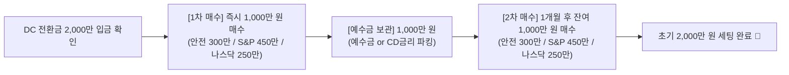

# 📱 미래에셋증권(M-STOCK) 퇴직연금(DC) [추천 2] 실전 세팅 매뉴얼

본 문서는 **미래에셋증권 모바일 앱(M-STOCK)**을 이용하여 **[추천 2] 대형주 극대화 (45% : 25% : 30%)** 최종 확정 포트폴리오를 처음부터 끝까지 혼자서 완벽하게 세팅할 수 있도록 작성된 최신 실전 매뉴얼입니다.

> ⚠️ **[중요 확인] 매수 종목코드 (6자리)**:
> * **위험자산 1 (45%)**: TIGER 미국S&P500 ➔ **`360750`**
> * **위험자산 2 (25%)**: TIGER 미국나스닥100 ➔ **`133690`**
> * **안전자산 (30%, 핵심)**: ACE 미국S&P500미국채혼합50액티브 ➔ **`438080`**  
> *(※ `396500`은 국내 반도체TOP10, `435420`은 기존 검토 후 제외한 TIGER 미국나스닥100채권혼합50이므로 절대 혼동하지 마세요!)*

---

## 🎯 세팅 대상 포트폴리오 요약

* **계좌 구분**: 본인 퇴직연금(DC) 계좌
* **초기 자금**: 약 2,000만 원 (2회 분할 매수: 각 1,000만 원씩)
* **월 적립금**: 매월 100만 원 (회사 퇴직연금 부담금 자동매수)
* **실질 자산 배분**: **주식 85.0% + 채권/현금 15.0%** (2023.11 퇴직연금감독규정 주식 50% 상한 기준)

| 자산 구분 | 종목명 | 종목코드 | 목표 비중 | 1차 매수 (즉시) | 2차 매수 (1달 후) | 매월 자동매수 (100만) |
| :--- | :--- | :---: | :---: | :---: | :---: | :---: |
| **안전 (핵심)** | **ACE 미국S&P500미국채혼합50액티브** | `438080` | **30.0%** | **300만 원** | **300만 원** | **30만 원** |
| **위험 1** | **TIGER 미국S&P500** | `360750` | **45.0%** | **450만 원** | **450만 원** | **45만 원** |
| **위험 2** | **TIGER 미국나스닥100** | `133690` | **25.0%** | **250만 원** | **250만 원** | **25만 원** |
| **합계** | *(실질 주식 비중 약 85%)* | - | **100%** | **1,000만 원** | **1,000만 원** | **100만 원 / 월** |

---

## 💡 [필독] 퇴직연금(DC) 매수 방식 이해하기

> ⚠️ **가장 많이 하는 실수**:  
> M-STOCK의 **[퇴직연금] → [매수비율 설정(입금상품 지정)]** 메뉴는 **일반 펀드 및 정기예금 전용**입니다. 여기에 들어가서 ETF를 검색하면 종목이 나오지 않습니다.
>
> * **ETF 매수 메커니즘**:
>   1. 회사가 매월 부담금(100만 원)을 입금하면 계좌 내 **'예수금(현금/대기자산)'**으로 입금됩니다.
>   2. M-STOCK의 **「연금 모으기」** (ETF 적립식 매수) 서비스가 매월 지정일에 이 예수금을 이용해 ETF 3종목을 자동으로 분할 매수합니다.

---

## 0️⃣ 사전 준비: ETF 거래 신청 확인 (최초 1회)

DC 계좌에서 ETF를 처음 거래하는 경우, 사전에 ETF 매매 신청이 되어 있어야 합니다.
1. M-STOCK 앱 실행 ➔ 상단 우측 **🔍(검색)** 클릭
2. 검색창에 **'ETF 거래신청'** 또는 **'파생상품 거래신청'** 검색 후 신청 여부 확인 및 약관 동의 진행

---

## 🛠️ PART 1. 초기 자금(2,000만 원) 실시간 분할 매수 가이드

시장 변동성 완화를 위해 **1,000만 원씩 2회(1달 간격)**로 나누어 매수합니다.



### [1차 매수 실행] (장중 09:00 ~ 15:30 실행)

1. **M-STOCK 앱 실행 및 로그인**
2. 상단 계좌 선택 영역에서 **본인의 '퇴직연금(DC)' 계좌가 선택되었는지 반드시 확인**
3. **종목 매수 방법 (가장 쉬운 방법)**:
   * 앱 상단 우측 **🔍(돋보기 아이콘)** 클릭 ➔ 종목코드 검색 후 선택 ➔ 하단 **[매수]** 클릭

4. **3개 종목 순차 매수 (수량 계산법)**:
   > 💡 **주문 팁**: 실시간 매매창은 '금액'이 아닌 **'주수(수량)'**로 주문합니다.  
   > `매수 수량 = 목표 금액 ÷ 현재가` (예: 1주당 26,000원이면 450만 원 ÷ 26,000원 = 약 173주)

   * ① **`438080` (ACE 미국S&P500미국채혼합50액티브)** (안전자산 30%)
     * **주문 목표**: 약 **300만 원**어치 수량 입력 후 [매수주문]
     * *(안전자산을 먼저 매수해 두면 위험자산 70% 한도 체크가 완벽히 통과됩니다)*
   * ② **`360750` (TIGER 미국S&P500)** (위험자산 45%)
     * **주문 목표**: 약 **450만 원**어치 수량 입력 후 [매수주문]
   * ③ **`133690` (TIGER 미국나스닥100)** (위험자산 25%)
     * **주문 목표**: 약 **250만 원**어치 수량 입력 후 [매수주문]

5. **잔여 예수금(약 1,000만 원) 보관**:
   * 현금(예수금) 그대로 두셔도 되고, 1개월간 파킹 이자를 원하시면 **`459580` (KODEX CD금리액티브)** 1,000만 원어치를 매수해 두었다가 2차 매수 당일 매도하셔도 됩니다.

### [2차 매수 실행] (1차 매수일로부터 1개월 뒤)
* 1차 매수와 동일하게 M-STOCK 접속 후 3개 종목을 동일한 금액(300만 / 450만 / 250만)으로 분할 매수합니다.

---

## ⚙️ PART 2. 매월 100만 원 자동매수 (연금 모으기) 설정 가이드

회사에서 매월 입금되는 퇴직연금 부담금(100만 원)을 매달 신경 쓰지 않고 자동으로 매수되도록 설정합니다.

### 📌 M-STOCK 앱 메뉴 이동 경로

```text
[M-STOCK 앱 실행]
    ▼
[하단 좌측 '≡ (전체메뉴)']
    ▼
[연금] 탭 선택
    ▼
[연금 모으기] ➔ [연금 모으기 신청]
```
*(※ 검색창에 **'연금 모으기'**를 직접 검색하셔도 바로 이동합니다)*

---

### 📝 포트폴리오 일괄 자동매수 등록 (1회 세팅으로 끝!)

미래에셋증권의 **「연금 모으기」**는 3개 종목을 한 화면에서 묶어 포트폴리오로 등록할 수 있습니다.

1. **계좌 선택**: 본인의 **'퇴직연금(DC)'** 계좌 선택
2. **종목 추가**: **[+ 종목 추가]** 버튼을 눌러 아래 3개 종목을 모두 담습니다.
   * ① **`438080` (ACE 미국S&P500미국채혼합50액티브)** ➔ 매수금액: **300,000 원** (30만 원)
   * ② **`360750` (TIGER 미국S&P500)** ➔ 매수금액: **450,000 원** (45만 원)
   * ③ **`133690` (TIGER 미국나스닥100)** ➔ 매수금액: **250,000 원** (25만 원)
   * *(총 합계 금액: **1,000,000 원**)*

3. **매수 주기 및 매수일 설정**:
   * **투자 주기**: **매월**
   * **매수일**: **회사 퇴직연금 입금일 기준 익영업일 또는 2~3일 뒤**  
     *(예: 매월 25일 급여/부담금 입금일인 경우 ➔ **26일 또는 27일**로 지정하여 잔고 부족 방지)*
   * **주문 방식**: **시장가** 또는 **최우선지정가**

4. **[신청하기]** 클릭 ➔ **자동매수 세팅 완료! 🚀**

---

## 🔒 PART 3. 주의사항 및 실전 운용 팁

1. **위험자산 70% 규정 준수**:
   * 본 포트폴리오는 위험자산(70% = S&P 45% + 나스닥 25%) + 안전자산(30%) 비율을 정확히 맞추어 설계되었으므로, 위험자산 초과 경고 없이 정상 작동합니다.
2. **나스닥100 단가 상승 및 우수리 예수금 처리**:
   * 나스닥100(1주 약 18~19만 원)은 매월 25만 원 설정 시 1주 매수 후 약 6~7만 원이 예수금으로 남습니다.
   * S&P500(45만 원)과 채권혼합(30만 원)에서 발생하는 소액 우수리 및 분배금과 함께 예수금에 모아두었다가 **3~6개월 또는 연말(12월)에 모아서 수동으로 1~2주 추가 매수**해 주시면 됩니다.
