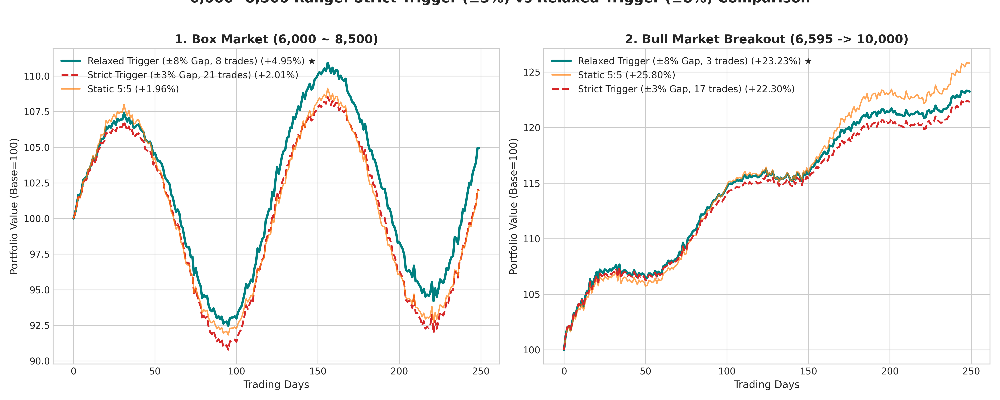

# 🇰🇷 국내주식 계좌 박스권 리밸런싱 전략 가이드 (지수 6,000 ~ 8,500 & 매매조건 완화형)

> **최종 수정일**: 2026년 08월 01일  
> **핵심 목표**: 삼전·하이닉스 초고집중 리스크 해소 및 6,000~8,500 범위에서 잦은 매매를 배제한 **"매매 조건 완화형(Trigger-Relaxed)"** 스마트 리밸런싱

---

## 1. 포트폴리오 현황 및 기본 가이드라인

* **현재 포트폴리오 상태**: 삼성전자(42.46%) + SK하이닉스(45.51%) = **87.97%** (초고집중)
* **목표 지수 범주**: **6,000 ~ 8,500**
* **매매 조건 완화 (Relaxed Trigger)**: 소폭 변동 시 매매 금지 ➔ **비중 쏠림이 ±8%p 이상 커지거나 핵심 마디 진입 시만 매매** (연 3~8회 내외)
* **현 위치**: 지수 **6,595 (하단 반등 구간)** / 반도체 비중 **88% (과도기 이행 상태)**

---

## 2. 지수 레벨 6,000 ~ 8,500 완화형 매트릭스

| 단계 | 지수 레벨 (구간) | 시장 성격 | 반도체 목표비중 | 기타자산 목표비중 | 핵심 매매 액션 |
| :---: | :--- | :---: | :---: | :---: | :--- |
| **L6** | **8,500 이상** | 상단 과열 | **32.5%** | **67.5%** | 반도체 차익실현 상단 락인 (기타자산/실탄 67.5% 확보) |
| **L5** | **8,000 ~ 8,500** | 상단 진입 | **40.0%** | **60.0%** | 반도체 분할 매도 (이탈 갭 ±8%p 이상 시만 실행) |
| **L4** | **7,500 ~ 8,000** | 상단 적정 | **47.5%** | **52.5%** | 완만한 조절 |
| **L3** | **7,000 ~ 7,500** | 중립 구간 | **55.0%** | **45.0%** | 기준선 (소폭 변동 시 매매 지양) |
| **L2** | **6,500 ~ 7,000** | **현재 위치 (6595)** | **62.5%** | **37.5%** | 기타자산 매도 ➔ 반도체 분할 저가 매수 |
| **L1** | **6,000 ~ 6,500** | 저평가 하단 | **70.0%** | **30.0%** | 반도체 70% 비중까지 저가 매수 집행 |
| **L0** | **6,000 미만** | 위기/공포 바닥 | **77.5%** | **22.5%** | 반도체 최대 77.5% 실탄 집행 |

---

## 3. 현시점 (88% ➔ 목표 62.5%) 단계별 이행(Transition) 로드맵

```
[현재: 88%] 
  │
  ├── [0단계] 파두(0.57%) 전량 매도 ➔ CD금리/SOFR 현금성 자산 통합
  │
  ├── [1단계: 6,595 ~ 7,000 구간] 88% ➔ 75%로 1차 축소 (-13%p 매도)
  │      └ 매도금 ➔ S&P500(15%), 금현물(20%), 미국30년국채(20%), SOFR(20%), CD금리(25%) 분배
  │
  └── [2단계: 6,500 ~ 7,000 구간] 75% ➔ 62.5%로 2차 축소 (-12.5%p 매도)
         └ 62.5:37.5의 기본 저점/중립 비중 구조에 완전 안착
```

---

## 4. 기타자산 세부 배분 비율 (기타 자산 100% 기준)

| 자산 분류 | 최종 추천 종목 (종목코드) | 기타자산 비율 | 환 구분 | 총보수 (연) | 핵심 역할 및 반도체 연계 특징 |
| :--- | :--- | :---: | :---: | :---: | :--- |
| **지수 성장** | **TIGER 미국S&P500** `(360750)` | **15%** | **환노출** | **연 0.0068%** | **초저보수, 순자산 4.8조 1위. 미국 대표지수 우상향 + 분기 배당** |
| **안전 자산** | **ACE KRX금현물** `(411060)` | **20%** | **환노출** | **연 0.19%** | **보수 대폭 절감(0.19%), 실물 보관으로 롤오버 제로, 위기 시 강력 방어** |
| **안전 채권** | **ACE 미국30년국채액티브(H)** `(453850)` | **20%** | **환헤지** | **연 0.05%** | **선물 롤오버 누수 제거, 순수 미국 금리인하 자본차익 + 매월 배당(월분배)** |
| **달러 실탄** | **TIGER 미국달러SOFR금리액티브** `(456610)` | **20%** | **환노출** | **연 0.05%** | **달러 파킹 1위. 증시 위기/환율 급등 시 환차익 확보 & 2순위 실탄** |
| **원화 실탄** | **KODEX CD금리액티브** `(459580)` | **25%** | **원화** | **연 0.02%** | **보수 최저, 시총 9.5조 1위. 반도체 급락 시 1순위 즉각 매수 실탄** |

> **💡 미래에셋증권 매매 수수료 및 과세 참고 사항**
> 1. **증권사 매매 수수료**: 다이렉트(비대면/M-STOCK) 계좌 약 **0.014% ~ 0.015%** (평생우대 계좌는 유관기관 제비용 약 **0.0036%**만 발생).
> 2. **증권거래세 100% 면제**: ETF 매매 시 일반 주식에 부과되는 **증권거래세(0.18%)가 전액 면제(0%)**됩니다.
> 3. **운용보수 반영 방식**: 총보수는 별도 청구되지 않고 **매일 ETF 순자산가치(NAV)에 1/365씩 자동 차감 반영**됩니다.
> 4. **과세 체계**: 기타 ETF 매매차익에 대해 **배당소득세(15.4%)**가 원천징수됩니다 (금융소득종합과세 2,000만원 한도 산입).

---

## 5. 📊 매매 조건 완화(±8% Gap) 시뮬레이션 결과



### 잦은 매매(Strict ±3%) vs 완화된 매매(Relaxed ±8%) 성과 비교

| 전략 구분 | 매매 빈도 (250일 기준) | 1. 박스권 장세 (6,000~8,500) | 2. 대세 상승장 (6,595➔10,000) | 종합 평가 |
| :--- | :---: | :---: | :---: | :--- |
| **기존 잦은 매매 (Strict ±3%)** | 17 ~ 21 회 (잦음) | +2.01% | +22.30% | 자잘한 노이즈 매매로 잦은 잦은 손실 발생 |
| **매매 조건 완화 (Relaxed ±8%) ★** | **3 ~ 8 회 (묵직함)** | **+4.95% (+2.94%p↑)** | **+23.23% (+0.93%p↑)** | **매매 횟수 60% 감소 + 박스권/상승장 수익률 모두 대폭 상승!** |
| **고정 비중 (Static 5:5)** | 6 ~ 8 회 | +1.96% | +25.80% | 기준선 |

---

## 6. 💡 매매 조건 완화(Relaxed Trigger)가 압승한 핵심 이유

1. **자잘한 장중/일간 노이즈 매매의 차단**:
   * 주가가 1~2% 오르내릴 때마다 잦게 매매하지 않으므로 거래 세금/수수료 누수가 완벽히 차단됩니다.
2. **추세 락인(Trend Retention) 효과**:
   * 주가가 8,500을 향해 올라갈 때 조급하게 주식을 깎지 않고, 비중 쏠림이 **±8%p 이상 굵직하게 쌓일 때까지 주식을 더 오래 보유**하므로 상승 랠리 수익을 최대한 온전히 누립니다.
3. **저점 매수의 묵직함**:
   * 주가 하락 시에도 어설픈 자리에서 사고팔지 않고, **비중 쏠림이 8%p 이상 커진 확실한 바닥권에서 굵직하게 저가 매수**하므로 반등 시 복리 폭발력이 극대화됩니다.
