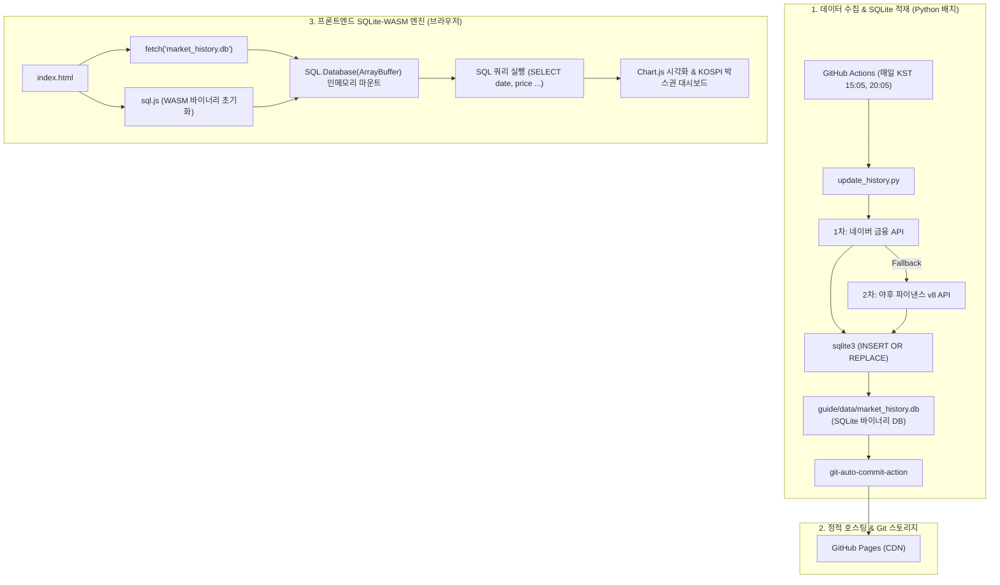

# 📋 SQLite-WASM 기반 시장 데이터 히스토리 수집 및 보관 기능 계획서

본 문서는 `my-stock` 포트폴리오 대시보드 확장을 위해 **주요 지수(KOSPI, S&P 500)** 및 **보유 주식/ETF**의 일별 종가 히스토리 데이터를 무료 API로 수집하고, **SQLite 바이너리 데이터베이스(`.db`)**와 **브라우저 SQLite-WASM (`sql.js`)** 기술을 활용하여 자동 갱신·보관·조회하는 시스템의 구축 계획서입니다.

---

## 1. 시스템 아키텍처 개요



---

## 2. 데이터베이스 스키마 설계 (`market_history.db`)

### 2.1. 테이블 DDL (`market_history`)
복합 기본키 `(date, code)`를 사용하여 날짜 및 종목별 고유성을 보장하며, `INSERT OR REPLACE` 구문으로 완벽한 Upsert(덮어쓰기)를 지원합니다.

```sql
CREATE TABLE IF NOT EXISTS market_history (
    date TEXT NOT NULL,          -- 거래일자 (YYYY-MM-DD)
    code TEXT NOT NULL,          -- 자산 고유 키 (kospi, snp500_index, samsung 등)
    name TEXT NOT NULL,          -- 자산명 (삼성전자, 코스피 지수 등)
    asset_type TEXT NOT NULL,    -- 자산 유형 (stock, index, foreign_index)
    price REAL NOT NULL,         -- 일별 종가
    updated_at TEXT NOT NULL,    -- 데이터 수집 일시 (YYYY-MM-DD HH:MM:SS)
    PRIMARY KEY (date, code)
);

-- 빠른 조회를 위한 복합 인덱스 (WHERE code = ? ORDER BY date ASC)
CREATE INDEX IF NOT EXISTS idx_code_date ON market_history(code, date);

-- 전일 대비 등락률(change_percent) 및 전일 종가(prev_price) 자동 계산 뷰
CREATE VIEW IF NOT EXISTS v_market_history AS
SELECT 
    date,
    code,
    name,
    asset_type,
    price,
    LAG(price, 1) OVER (PARTITION BY code ORDER BY date ASC) AS prev_price,
    ROUND((price - LAG(price, 1) OVER (PARTITION BY code ORDER BY date ASC)) / LAG(price, 1) OVER (PARTITION BY code ORDER BY date ASC) * 100, 2) AS change_percent,
    updated_at
FROM market_history;
```

### 2.2. 저장 용량 및 성능 특성
* **레코드 수**: 9개 자산 × 50거래일 = 450행
* **DB 파일 크기**: 약 **88 KB** (SQLite 기본 페이지 헤더 및 B-Tree 인덱스 포함)
* **WASM 로딩 시간**: `0.05초` 미만 (브라우저 메모리에 즉시 적재)

---

## 3. 데이터 수집 대상 및 API 매핑

> ⚠️ **키 네이밍 정책**: `snp500` 키는 기존 코드베이스(`live_market.js`, `index.html`)와의 호환성을 위해 **TIGER 미국S&P500 ETF(360750)**에 할당하고, **S&P 500 지수**는 `snp500_index`로 명명합니다.

| 구분 | 자산명 | 티커 / 고유 키 | 1차 소스 (네이버) | 2차 소스 (야후 백업) |
|---|---|:---:|:---:|:---:|
| **지수** | **KOSPI 지수** | `kospi` | `https://m.stock.naver.com/api/index/KOSPI/price` | `^KS11` |
| **지수** | **S&P 500 지수** | `snp500_index` | `https://api.stock.naver.com/index/.INX/price` | `^GSPC` |
| **주식** | 삼성전자 | `samsung` (`005930`) | `https://m.stock.naver.com/api/stock/005930/price` | `005930.KS` |
| **주식** | SK하이닉스 | `hynix` (`000660`) | `https://m.stock.naver.com/api/stock/000660/price` | `000660.KS` |
| **ETF** | KODEX CD금리액티브 | `cd` (`459580`) | `https://m.stock.naver.com/api/stock/459580/price` | `459580.KS` |
| **ETF** | TIGER 미국달러SOFR | `sofr` (`456610`) | `https://m.stock.naver.com/api/stock/456610/price` | `456610.KS` |
| **ETF** | ACE 미국30년국채액티브(H) | `us30b` (`453850`) | `https://m.stock.naver.com/api/stock/453850/price` | `453850.KS` |
| **ETF** | ACE KRX금현물 | `gold` (`411060`) | `https://m.stock.naver.com/api/stock/411060/price` | `411060.KS` |
| **ETF** | TIGER 미국S&P500 | `snp500` (`360750`) | `https://m.stock.naver.com/api/stock/360750/price` | `360750.KS` |

---

## 4. 백엔드 수집 스크립트 규격 (`update_history.py`)

Python 표준 내장 라이브러리(`sqlite3`, `urllib.request`, `json`)만 사용하여 외부 패키지 설치 없이 가볍고 안전하게 실행됩니다.

### 4.1. 동작 모드
1. **초기 적재 모드 (`--init`)**:
   * 각 종목별 `pageSize=50` (약 2.5개월 거래일) 조회
   * 450여 개 레코드를 `INSERT OR REPLACE`로 일괄 적재
2. **일일 갱신 모드 (`--update`, KST 15:05, 20:05 일 2회 자동 실행)**:
   * 각 종목별 최근 5일치(`pageSize=5`) 조회
   * 기존 DB에 `INSERT OR REPLACE` 실행 → 최근 5일 치 종가 갱신 및 신규 날짜 자동 추가

### 4.2. 비공식 API 방어 및 정규화 로직
* **포맷 정규화**: S&P 500 등 타임존 일시(`2026-08-26T16:39:23-04:00`)는 `YYYY-MM-DD`로 자동 슬라이싱.
* **응답 유효성 검사**: 응답이 리스트가 아니거나 필수 키가 없으면 해당 종목만 야후 파이낸스로 즉시 Fallback 전환.

---

## 5. 프론트엔드 SQLite-WASM 연동 규격 (`index.html`)

브라우저는 `sql.js` CDN을 통해 WASM 엔진을 초기화하고, `fetch()`로 DB 바이너리를 받아 SQL 쿼리를 직접 수행합니다.

### 5.1. FE 연동 코드 예시 (JavaScript)

```html
<!-- 1. sql.js CDN 로드 -->
<script src="https://cdnjs.cloudflare.com/ajax/libs/sql.js/1.12.0/sql-wasm.js"></script>

<script>
async function loadMarketHistoryDB() {
  try {
    // 2. WASM 엔진 초기화
    const SQL = await initSqlJs({
      locateFile: file => `https://cdnjs.cloudflare.com/ajax/libs/sql.js/1.12.0/${file}`
    });

    // 3. SQLite 바이너리 파일 다운로드
    const response = await fetch('guide/data/market_history.db');
    const buf = await response.arrayBuffer();
    const db = new SQL.Database(new Uint8Array(buf));

    console.log("✅ SQLite-WASM DB Mounted Successfully!");

    // 4. SQL 쿼리 실행: 특정 종목의 일별 히스토리 조회
    const stmt = db.prepare("SELECT date, price FROM market_history WHERE code = :code ORDER BY date ASC");
    stmt.bind({ ':code': 'kospi' });

    const labels = [];
    const prices = [];
    while (stmt.step()) {
      const row = stmt.getAsObject();
      labels.push(row.date);
      prices.push(row.price);
    }
    stmt.free();

    // 5. Chart.js 렌더링 호출
    renderKospiHistoryChart(labels, prices);
    
    return db;
  } catch (err) {
    console.error("Failed to load SQLite-WASM DB:", err);
  }
}
</script>
```

### 5.2. 한/미 휴장일 결측치(Gap) 처리 방안
* 한국과 미국의 공휴일이 달라 특정 날짜에 데이터가 없는 경우, 프론트엔드에서 **Forward-fill (직전 영업일 종가 유지)** 로직을 적용하거나 Chart.js의 `spanGaps: true` 설정을 활성화하여 선 그래프가 끊김 없이 자연스럽게 연결되도록 처리합니다.

---

## 6. GitHub Actions 자동화 워크플로우 (`history.yml`)

기존 `monitor.yml`(UTC 11:00 트리거)과의 충돌을 방지하기 위해 **5분 오프셋**을 적용하여 `UTC 11:05 (= KST 20:05)`에 실행합니다.

```yaml
name: Daily Market History DB Update

on:
  schedule:
    # 월~금 한국시간 20:05 (UTC 11:05)
    - cron: '5 11 * * 1-5'
  workflow_dispatch:

permissions:
  contents: write

jobs:
  update-history-db:
    runs-on: ubuntu-latest
    steps:
      - name: Checkout Repository
        uses: actions/checkout@v4

      - name: Set up Python
        uses: actions/setup-python@v5
        with:
          python-version: '3.10'

      - name: Run History DB Updater
        run: python update_history.py --update

      - name: Commit & Push Changes
        uses: stefanzweifel/git-auto-commit-action@v5
        with:
          commit_message: "chore: update market_history.db [skip ci]"
          file_pattern: "guide/data/market_history.db"
```

---

## 7. 단계별 구현 마일스톤

| 단계 | 작업 내용 | 진행 상태 | 결과물 |
|:---:|---|:---:|---|
| **Phase 1** | SQLite 기반 수집 스크립트 개발 | ✅ 완료 | `update_history.py` |
| **Phase 2** | 초기 2달치 데이터 SQLite DB 적재 | ✅ 완료 | `guide/data/market_history.db` (88KB, 450건) |
| **Phase 3** | GitHub Actions 워크플로우 배포 | ⏳ 대기 | `.github/workflows/history.yml` (KST 20:05) |
| **Phase 4** | 대시보드(`index.html`) SQLite-WASM 연동 | ⏳ 대기 | `sql.js` 로더 및 KOSPI 추세 차트 |

---
*문서 작성일: 2026-08-28*
*작성자: Antigravity AI*
